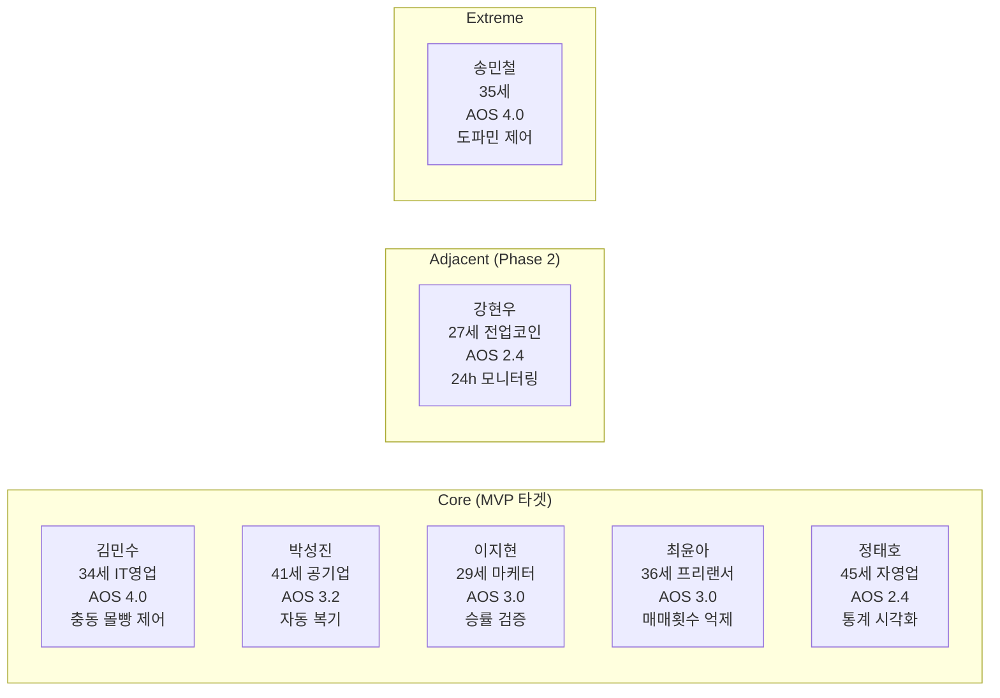
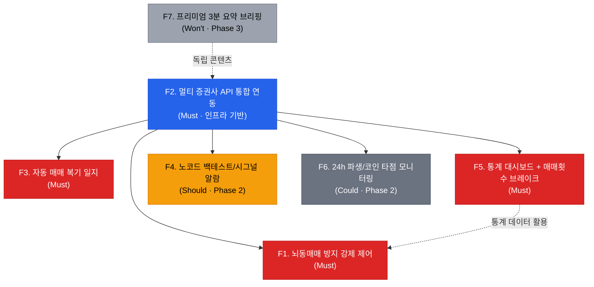
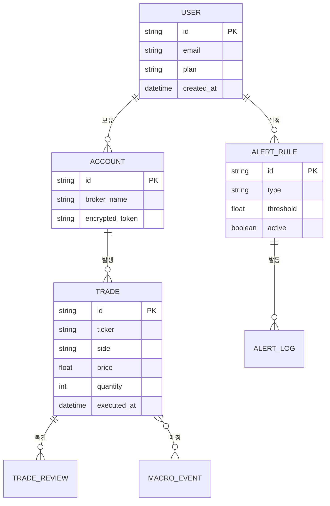

# 감정 제어 투자 SaaS — PRD v0.1

- **Owner 팀:** Product / Engineering
- **최종 업데이트:** 2026-04-26

---

## 1. 개요·목표

### 1-1. 문제 정의 (Pain 지표 포함)

데이터 기반 투자를 지향하는 개인 투자자가 영상 시청 후 실전 적용 단계에서 **스스로 검증·시뮬레이션할 수 있는 디지털 도구가 부재**하여 감정적 매매를 반복한다.

| Pain | 실패 KPI (현재 상태) |
|---|---|
| 충동적 뇌동매매 반복 → 계좌 반토막 | 주간 계획 외 매매 비율 ≥ 60%, 월 손실률 ≥ 20% |
| 수기 매매일지 작심삼일 | 일지 연속 기록일 ≤ 3일 (유지율 < 15%) |
| 퀀트 툴 진입장벽 | 노코드 백테스트 도구 부재, 파인스크립트 학습 포기율 > 80% |
| SaaS 가입 후 이탈 | 리텐션 D3 ≤ 40%, 가입→유료 전환율 < 5% |

### 1-2. 목표 (Desired Outcome 수치화)

- **주간 뇌동매매 횟수 0회** 달성 (김민수 Outcome)
- **퇴근 후 매매 복기 소요 시간 3분 미만** (박성진 Outcome)
- **일일 매매 횟수 50% 감축** (최윤아 Outcome)
- **계좌 연동 1분 이내, 수기 입력 0건** (박성진 Outcome)

### 1-3. 성공 지표

| 구분 | KPI | 기준선 | 목표값 | 측정 주기 | 측정 경로 |
|---|---|---|---|---|---|
| **북극성** | WAU 중 주간 뇌동매매 0회 유저 비율 | 0% (서비스 미존재) | ≥ 40% | 주간 | Mixpanel `unplanned_trade_count == 0` / WAU |
| 보조 1 | D7 리텐션 | 업계 SaaS 평균 20% (Lenny's Newsletter 2025) | ≥ 35% | 주간 | Mixpanel 코호트 `session_start` D0 vs D7 |
| 보조 2 | 무료→유료 전환율 | 업계 Freemium 평균 3~5% (OpenView 2025) | ≥ 8% | 월간 | Stripe `subscription_created` / `signup_completed` |
| 보조 3 | 평균 복기 시간 | 수기 30분 (JTBD 인터뷰 자가 보고) | ≤ 3분 (p50) | 월간 | 앱 내 `review_session_duration` 중앙값 |
| 보조 4 | NPS | 업계 핀테크 평균 30 (Retently 2025) | ≥ 50 | 분기 | 분기별 인앱 NPS 서베이 (Delighted) |

---

## 2. 사용자와 페르소나

### 2-1. 핵심 페르소나 요약

### 2-2. 고객 행동 여정 Pain·Needs

| 여정 단계 | 심리 | Pain | Needs (SaaS 접점) |
|---|---|---|---|
| 1. 탐색 (Newbie) | "유망 종목 찝어주세요" | 정보 과부하 | 무료 시황 요약 알림 |
| **2. 시행착오 (Learner)** | "왜 손실이 났을까?" | **뇌동매매 반복** | **매매일지·리뷰 툴** |
| **3. 자립 (Trader)** | "손익비 관리가 핵심" | **조건검색 부재** | **커스텀 알림 모듈** |
| 4. 최적화 (Master) | "감정 차단, 기계적 매매" | API 연동 한계 | 알고리즘 백테스팅 |

> **초기 집중:** 단계 2~3 사이의 '각성적 학습자' (SOM 3,000~5,000명)

---

## 3. 사용자 스토리와 수용 기준 (AC)

### Story 1 — 뇌동매매 방지 (F1)

**As a** 충동 매매로 반복 손실을 겪는 투자자 (김민수),
**I want** 사전 설정한 일일 최대 손실폭 도달 시 강제 경고 알람을 받고 싶다,
**So that** 감정적 복수매매를 원천 차단하고 주간 뇌동매매 0회를 달성한다.

| AC | Given | When | Then | 임계치 |
|---|---|---|---|---|
| AC1 | 사용자가 일일 최대 손실폭(슬라이더)을 설정한 상태 | 당일 누적 손실이 설정값에 도달 | 3초 이내 팩트폭행 알람(푸시+모달) 발동 | 알람 지연 ≤ 3초, 발동 실패율 < 0.5% |
| AC2 | 알람이 발동된 상태 | 사용자가 추가 매수 시도 | 쿨타임(최소 30분) 동안 매수 버튼 비활성화 | 우회율 < 1% |
| AC3 | 주간 종료 시점 | 시스템이 뇌동매매 리포트 생성 | 계획외 매매 횟수·손실액 자동 집계 리포트 발송 | 리포트 정확도 ≥ 99% |
| **AC-E1** | **증권사 API 장애로 실시간 손익 조회 불가** | **손실폭 계산 실패** | **"데이터 수신 지연" 배너 표시 + 마지막 정상 값 기준 보수적 알람 유지 + 장애 5분 이상 시 PagerDuty 알림** | **Fallback 알람 ≤ 10초, 장애 미통지율 0%** |
| **AC-E2** | **사용자가 손실폭을 0% 또는 음수로 설정 시도** | **슬라이더 입력값 검증** | **최소 0.5%~최대 30% 범위 외 값 거부, 인라인 에러 메시지 표시** | **유효성 검증 우회율 0%** |

### Story 2 — 자동 매매 복기 일지 (F3)

**As a** 장중 대응이 어려운 직장인 투자자 (박성진),
**I want** 퇴근 후 매매 타점과 당시 매크로 뉴스가 자동 매칭된 복기 일지를 받고 싶다,
**So that** 3분 이내에 오늘의 매매를 복기하고 동일 실수를 방지한다.

| AC | Given | When | Then | 임계치 |
|---|---|---|---|---|
| AC1 | 증권사 API 연동 완료 상태 | 장 마감 후 30분 이내 | 자동 매매 일지(타점+차트+뉴스 매칭) 생성 | 생성 완료 ≤ 30분, 매칭 정확도 ≥ 95% |
| AC2 | 일지가 생성된 상태 | 사용자가 복기 화면 오픈 | 3분 이내 핵심 인사이트 스캔 가능한 UI | 복기 소요시간 ≤ 3분 (p50) |
| AC3 | 주말 시점 | 사용자가 PDF 추출 요청 | 주간 종합 복기 PDF 다운로드 | PDF 생성 ≤ 10초, 실패율 < 1% |
| **AC-E1** | **당일 매매 건수가 0건인 상태** | **장 마감 후 일지 생성 트리거** | **"오늘 매매 내역이 없습니다" 안내 카드 표시, 빈 일지를 생성하지 않음** | **빈 일지 오생성율 0%** |
| **AC-E2** | **매크로 뉴스 API 응답 실패(타임아웃 > 10초)** | **타점-뉴스 매칭 시도** | **뉴스 영역에 "수집 실패 — 수동 태깅 가능" 표시, 나머지 일지는 정상 생성** | **부분 실패 시 일지 전체 미생성율 0%** |

### Story 3 — 멀티 증권사 통합 연동 (F2)

**As a** 복수 증권사를 사용하는 투자자 (박성진),
**I want** 키움·토스·NH 등 계좌를 1분 내에 통합 연동하고 싶다,
**So that** 수기 입력 없이 모든 매매 데이터를 한 곳에서 관리한다.

| AC | Given | When | Then | 임계치 |
|---|---|---|---|---|
| AC1 | 사용자가 온보딩 진입 | 증권사 선택 후 인증 | 계좌 연동 완료 | 연동 소요 ≤ 60초, 성공률 ≥ 98% |
| AC2 | 연동 완료 상태 | 신규 매매 발생 | 5분 이내 자동 동기화 | 동기화 지연 ≤ 5분, 누락률 < 0.1% |
| AC3 | 복수 증권사 연동 상태 | 통합 대시보드 조회 | 전 계좌 합산 포지션·손익 표시 | 데이터 정합성 ≥ 99.9% |
| **AC-E1** | **잘못된 인증 정보(만료 토큰·오입력) 제출** | **연동 인증 요청** | **"인증 정보가 유효하지 않습니다" 에러 + 재시도 유도 (최대 3회)** | **에러 메시지 표시 ≤ 2초, 무한 재시도 방지** |
| **AC-E2** | **특정 증권사 API 점검(서버 다운) 상태** | **해당 증권사 연동 시도** | **"현재 [증권사명] 서버 점검 중" 표시 + 나머지 증권사 정상 진행** | **장애 감지 ≤ 30초, 정상 증권사 영향 0%** |

### Story 4 — 통계 대시보드 + 매매 횟수 브레이크 (F5)

**As a** 잦은 매매로 본업에 지장이 있는 투자자 (최윤아),
**I want** 매매 통계 대시보드와 일일 매매 횟수 브레이크를 사용하고 싶다,
**So that** 일일 매매 횟수를 50% 감축하고 손실 습관을 교정한다.

| AC | Given | When | Then | 임계치 |
|---|---|---|---|---|
| AC1 | 대시보드 접속 | 페이지 로딩 | 승률·MDD·매매횟수 등 핵심 통계 시각화 | 로딩 ≤ 2초 (p95, 동시 500명 기준) |
| AC2 | 일일 매매 횟수 상한 설정 상태 | 상한 도달 | 강제 휴식 유도 알림 + 매매 쿨다운 | 알림 ≤ 3초 |
| AC3 | 월말 시점 | 월간 리포트 자동 생성 | 전월 대비 매매 횟수·충동 매매 비율 비교 | 리포트 정확도 ≥ 99% |
| **AC-E1** | **매매 데이터가 30일 미만(신규 유저)** | **대시보드 통계 조회** | **"데이터 축적 중 (현재 N일치)" 안내 + 가용 기간 한정 통계만 표시** | **빈 대시보드 에러율 0%** |

---

## 4. 기능 요구사항 (Functional) — MoSCoW

| 우선순위 | 기능 | 근거 (대안 대비 가치) |
|---|---|---|
| **Must** | F1. 뇌동매매 방지 강제 제어 | AOS 4.0 (최고), 기존 대안 0 — 엑셀 자기통제는 실패율 85%+ |
| **Must** | F2. 멀티 증권사 API 통합 연동 | 전 기능의 인프라 전제조건, 수기 입력 제거 |
| **Must** | F3. 자동 매매 복기 일지 | AOS 3.2, 기존 토스/MTS는 단순 수익률만 제공 |
| **Must** | F5. 통계 대시보드 + 매매횟수 브레이크 | AOS 3.0, 기존 증권앱에 브레이크 기능 전무 |
| **Should** | F4. 노코드 백테스트/시그널 알람 | AOS 3.0, Phase 2 — 리텐션 증명 후 도입 |
| **Could** | F6. 24h 파생/코인 타점 모니터링 | AOS 2.4, Adjacent 확장 — 인프라 비용 높음 |
| **Won't** | F7. 프리미엄 3분 요약 브리핑 | Phase 3, Premium Tier 설계 완료 후 |

### 4-1. 기능 의존성 그래프

> **핵심 의존성:** F2(증권사 API 연동)는 F1·F3·F5의 **선행 필수 인프라**. 스프린트 계획 시 F2를 Sprint 1에 배치하고, F1·F3·F5는 Sprint 2~3에서 병렬 착수.

### 4-2. Could(F6) 1스프린트 내 구현 가능성 판단

| 판단 항목 | 평가 | 근거 |
|---|---|---|
| 기술 복잡도 | **높음** | 24시간 실시간 WebSocket 스트리밍, 틱 단위 지연 < 100ms 요구 (강현우 JTBD) |
| 인프라 비용 | **높음** | 상시 가동 인스턴스 필요, 사용자당 월 인프라 비용 기준선의 2~3배 예상 |
| 외부 의존성 | **높음** | 바이낸스/업비트 API 별도 연동 + 파생상품 거래소 규제 확인 필요 |
| **1스프린트(2주) 구현** | **불가** | 최소 2스프린트(4주) + α 필요. MVP 코어 유저 리텐션 D30 ≥ 25% 달성 후 Phase 2 착수 조건으로 유보 |

---

## 5. 비기능 요구사항 (NFR)

| 항목 | 요구사항 | 부하/측정 조건 |
|---|---|---|
| **성능** | 대시보드 p95 응답 ≤ 500ms, 알람 발동 p99 ≤ 3초 | 동시 접속 500명 기준, k6 부하 테스트 (ramp-up 10분) |
| **확장성** | 동시 접속 2,000명까지 p95 ≤ 1초 유지 | SOM 5,000명 × 피크 계수 0.4 기준 |
| **신뢰성** | 월 가용성 ≥ 99.5% (다운타임 ≤ 3.6시간/월), 동기화 오류율 ≤ 0.1% | UptimeRobot 외부 모니터링, 월간 SLA 리포트 |
| **보안** | API 토큰 AES-256 (at-rest), TLS 1.3 (in-transit), OAuth 2.0 PKCE | 분기 1회 침투 테스트 (3rd-party), 연 1회 ISMS 갱신 심사 |
| **비용** | 사용자당 월 인프라 비용 ≤ 5,000원 (인프라 마진 ≥ 90%) | 월간 AWS Cost Explorer 추적 |

### 모니터링 알림 규칙

| 대시보드 패널 | 메트릭 | 경고 (Warning) | 긴급 (Critical) | 알림 채널 |
|---|---|---|---|---|
| API 응답 시간 | p95 latency | > 500ms (5분 지속) | > 1,000ms (2분 지속) | Slack #ops → PagerDuty |
| 에러율 | 5xx rate | > 0.5% (5분 평균) | > 1% (2분 평균) | PagerDuty 즉시 호출 |
| 증권사 동기화 지연 | sync_delay_seconds | > 300초 | > 600초 | Slack #data-pipeline |
| 알람 발동 실패 | alert_fire_failure_rate | > 0.3% | > 0.5% | PagerDuty 즉시 호출 |
| 인프라 비용 | cost_per_user_monthly | > 4,000원 | > 5,000원 | Slack #finance (일간) |

---

## 6. 데이터·인터페이스 개요

### 6-1. 핵심 엔터티

### 6-2. 외부/내부 API 개요

| API | 방향 | 입력 | 출력 | 제약 |
|---|---|---|---|---|
| 키움 Open API | 외부 → 수신 | OAuth 토큰 | 체결 내역, 잔고 | 호출 제한 1회/초 |
| 토스 증권 API | 외부 → 수신 | 인증 키 | 거래 내역 | 일 5,000회 |
| NH 나무 API | 외부 → 수신 | 인증 키 | 거래 내역 | 일 10,000회 |
| 매크로 뉴스 API (자체) | 내부 | 날짜/시간 | 뉴스 이벤트 목록 | — |
| 알람 서비스 (FCM/APNs) | 내부 → 발신 | 유저ID, 메시지 | 푸시 알림 | 지연 ≤ 1초 |

---

## 7. 범위(In/Out), 리스크·가정·의존성

### 7-1. In/Out Scope

| In (MVP v1) | Out (향후) |
|---|---|
| F1 뇌동매매 방지 강제 제어 | F4 노코드 백테스트 (Phase 2) |
| F2 멀티 증권사 API 연동 (키움·토스·NH) | F6 24h 파생/코인 모니터링 (Phase 2) |
| F3 자동 매매 복기 일지 | F7 프리미엄 3분 브리핑 (Phase 3) |
| F5 통계 대시보드 + 매매횟수 브레이크 | 자동 주문 집행 (규제 이슈) |
| 웹 앱 (반응형) | 네이티브 모바일 앱 |

### 7-2. 리스크

| # | 리스크 | 발생 확률 | 영향도 | 영향 | 완화 방안 |
|---|---|---|---|---|---|
| R1 | **증권사 API 정책 변경/제한** | 중 | 치명 | 핵심 데이터 파이프라인 중단 | 스크래핑 폴백, 복수 증권사 지원으로 의존도 분산 |
| R2 | **금융 규제 (유사투자자문)** | 중 | 치명 | 서비스 중단 위험 | 법률 자문 확보, '정보 제공'과 '자문' 경계 명확화 |
| R3 | **보안 사고 (계좌 정보 유출)** | 하 | 치명 | 신뢰 붕괴, 사업 존폐 | ISMS 인증, 침투 테스트 분기 실시, 버그바운티 |
| R4 | **Cold Start — 초기 유저 확보 난항** | 중 | 상 | PMF 검증 지연 | 무료 팩트폭행 리포트로 바이럴 유입 |

### 7-3. 가정·의존성 및 Kill Criteria

| 항목 | 내용 | Kill Criteria (무효화 조건) | 무효화 시 대응 |
|---|---|---|---|
| 가정 1 | SOM 3,000~5,000명의 '각성적 학습자'는 월 5만 원 WTP 보유 | Closed Beta(n=300) 유료 전환율 < 3% 또는 Van Westendorp 조사 적정가격대 < 2만 원 | 가격 체계 피벗 (월 2~3만 원 Tier 신설) 또는 B2B(증권사 제휴) 모델 전환 검토 |
| 가정 2 | 키움·토스·NH 3사가 전체 타겟 사용자의 80% 이상 커버 | Beta 기간 중 미지원 증권사 요청 비율 > 30% | 4순위 증권사(삼성·미래에셋) API 연동을 Sprint 4 이내 긴급 추가 |
| 의존성 | 증권사 Open API 안정적 제공, FRED/Statista 데이터 API 가용성 | 증권사 API 가용률 < 95% (월간) 또는 FRED 데이터 지연 > 1시간 | CSV 수동 업로드 폴백 UI 즉시 배포, 대안 데이터 소스(KRX 공시) 파이프라인 구축 |

### 7-4. ADR (Architecture Decision Records)

#### ADR-001: 증권사 연동 방식 — 공식 API 우선, 스크래핑 폴백

- **상태:** 채택
- **맥락:** 증권사 데이터 수집 방식으로 (A) 공식 Open API, (B) 웹 스크래핑, (C) 사용자 CSV 업로드 3가지 선택지 존재
- **결정:** (A) 공식 API를 1순위로 채택, (B) 스크래핑을 장애 시 폴백으로 유지
- **근거:** 공식 API는 데이터 정합성 99.9% + 법적 리스크 제로. 스크래핑은 증권사 약관 위반 가능성 있으나 API 장애 시 서비스 연속성 확보에 필수. CSV 업로드는 사용자 경험 저하(수기 입력과 동일)로 기본 방식에서 제외.
- **리스크:** R1(API 정책 변경) 발생 시 스크래핑 폴백의 법적 검토 필요 → 변호사 자문 사전 확보

#### ADR-002: 알람 아키텍처 — 서버 사이드 이벤트 기반

- **상태:** 채택
- **맥락:** 뇌동매매 방지 알람을 (A) 클라이언트 폴링, (B) 서버 사이드 이벤트(SSE), (C) WebSocket 중 선택
- **결정:** (B) SSE 채택. 단방향 알림 전송에 최적, WebSocket 대비 인프라 비용 40% 절감
- **근거:** 알람은 서버→클라이언트 단방향. SSE는 HTTP/2 호환, 재연결 자동 지원, 연결당 메모리 < 1KB. 동시 2,000명 기준 WebSocket 대비 서버 비용 40% 절감 (§5 비용 NFR 충족)
- **트레이드오프:** 양방향 통신 필요 시(Phase 2 F6 실시간 모니터링) WebSocket 마이그레이션 필요

#### ADR-003: 데이터 저장 — 매매 일지 데이터 락인 전략

- **상태:** 채택
- **맥락:** 사용자 매매 일지·복기 데이터를 (A) 로컬 저장, (B) 클라우드 중앙 저장, (C) 하이브리드 중 선택
- **결정:** (B) 클라우드 중앙 저장 (PostgreSQL + S3)
- **근거:** 수개월간 축적된 매매 일지 데이터가 전환 비용(Switching Cost)을 생성하여 해지 방지 → VPS §5 비즈니스 액션 플랜의 '데이터 락인' 전략 직접 구현. 로컬 저장은 디바이스 분실 시 데이터 소실 + 멀티 디바이스 불가.
- **보안 조치:** at-rest AES-256 암호화, 사용자별 논리 격리(row-level security)

---

## 8. 실험·롤아웃·측정

### 8-1. 베타 채널

- **Closed Beta:** 초기 300명 (JTBD 인터뷰 참여자 + 투자 커뮤니티 얼리어답터)
- **기간:** 4주
- **채널:** 웹 앱 (invite-only)

### 8-2. 실험 가설·측정·성공 기준

| 실험 | 가설 | 측정 방법 | 성공 기준 |
|---|---|---|---|
| A/B 테스트: 뇌동매매 알람 ON/OFF | 알람 그룹의 주간 충동매매 횟수가 유의하게 감소 | n=300, 2주, 주간 계획외 매매 횟수 | 알람 그룹 충동매매 ≥ 50% 감소 (p < 0.05) |
| 코호트 분석: 자동 복기 일지 사용 여부 | 일지 사용 그룹의 D14 리텐션이 유의하게 높음 | 코호트 비교, n≥200/그룹 | 일지 사용 그룹 D14 리텐션 ≥ 2배 |
| 온보딩 퍼널: 증권사 연동 UX | 연동 완료율이 전환율 병목 | 퍼널 분석 (Mixpanel) | 온보딩→연동 완료 ≥ 70% |

### 8-3. 경쟁 대안 대비 벤치마크

| 비교 항목 | 기존 대안 (수기 엑셀 / 텔레그램) | 본 서비스 목표 |
|---|---|---|
| 매매 기록 소요 시간 | 30분+ (수기) | ≤ 0분 (자동) |
| 복기 시작까지 대기 | 수시간 (수동 정리) | ≤ 30분 (자동 생성) |
| 뇌동매매 제어 기능 | 없음 | 하드락 알람 + 쿨타임 |
| 월 비용 | 30만 원 (텔레그램) / 0원 (엑셀) | 5~10만 원 |
| 데이터 축적 락인 | 없음 | 수개월 매매 일지 데이터 |

---

## 9. 근거 (Proof)

### 9-1. 실험 설계 ↔ 측정 도구 매핑

| 주장 | 실험 설계 | 검정력 근거 | 측정 도구 (Metrics) |
|---|---|---|---|
| 뇌동매매 알람이 충동 매매를 50% 감소시킨다 | A/B 테스트 (n=300, 150/그룹, 2주) | α=0.05, β=0.2 (power=80%), MDE=50%, 주간 평균 4회(σ=2) → 그룹당 최소 n=128 충족 | 주간 계획외 매매 횟수 (`unplanned_trade_count`), 주간 손실액 (`weekly_loss_amount`) |
| 자동 복기 일지가 리텐션을 2배 높인다 | 코호트 비교 (n≥200/그룹, 4주 관찰) | α=0.05, β=0.2, 기준 D14 15%→목표 30%, 그룹당 최소 n=180 충족 | D7/D14 리텐션 (`session_start` 코호트), 주간 세션 빈도 |
| 각성적 학습자의 WTP는 월 5만 원 이상이다 | Van Westendorp 가격 민감도 조사 (n=500) | 95% 신뢰구간 ±4.4%p (n=500 기준) | 지불의사금액 분포, 전환율 (`subscription_created`) |
| 기존 대안 대비 처리 속도 30배 향상 | 내부 벤치마크 (n=50 태스크, 반복 3회) | 환경: AWS t3.medium, 2vCPU 8GB, RDS PostgreSQL 14, 100건 매매 기록 | 복기 완료 시간: 수기 30분 vs 자동 `review_generation_time` p50 |

### 9-2. 참고 레퍼런스

| # | 출처 |
|---|---|
| 1 | 한국예탁결제원 (2024.12) — 개인투자자 1,423만 명 |
| 2 | 금융감독원·경찰청 — 불법 리딩방 피해액 1.3조 원, 1.4만 건 |
| 3 | Forbes Korea — 크리에이터 이코노미 동향 (1인 미디어 약 5조 원) |
| 4 | 자본시장연구원(KCMI) — 핀플루언서 편향적 정보 확산과 개인 투자자 행동 변화 |
| 5 | 유튜브 멤버십 통계(Playboard) — 금융 카테고리 월 3~12만 원 고단가 구독 |
| 6 | JTBD 가상 심층 인터뷰 (김민수·박성진·강현우) — AOS/DOS 산출 결과 |
| 7 | AOS 12종 페르소나 매트릭스 — Q1 혁신기회 7인 선별 |

### 9-3. 차별 가치 수치 비교

| 비교 축 | 기존 대안 | 본 서비스 | 차이 | 출처/근거 |
|---|---|---|---|---|
| **데이터 처리 속도** | 수기 30분 | 자동 < 1분 | **30배 ↑** | JTBD 인터뷰 자가보고 평균 (박성진·김민수) |
| **월 비용** | 텔레그램 리딩방 30만 원 | SaaS 5~10만 원 | **67~83% ↓** | 금감원 불법리딩방 평균 과금 조사 (2024) |
| **매매 기록 정확도** | 엑셀 수기 70±10% (입력 누락·수식 오류) | API 자동 연동 99.9% | **정확도 +30%p** | 수기 오류율: Panko (2008) 스프레드시트 오류 연구; API: 증권사 체결 데이터 SLA |
| **충동 매매 감소** | 자기 의지 제어 → 감소 미미 (< 10%) | 하드락 알람 + 쿨타임 → 목표 50% 감소 | **감소율 +40%p** | A/B 테스트 검증 예정 (§8.2); 행동경제학 넛지 효과 (Thaler & Sunstein, 2008) |

---

> **문서 버전:** v0.1 (초안)
> **다음 단계:** Closed Beta 설계, 증권사 API 파트너십, 법률 검토
