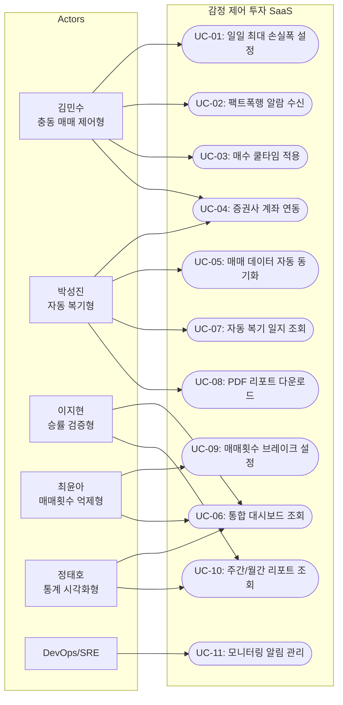
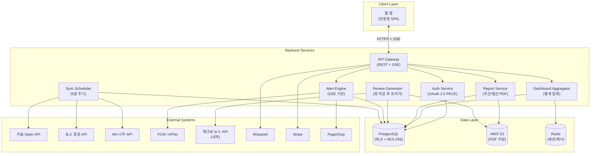
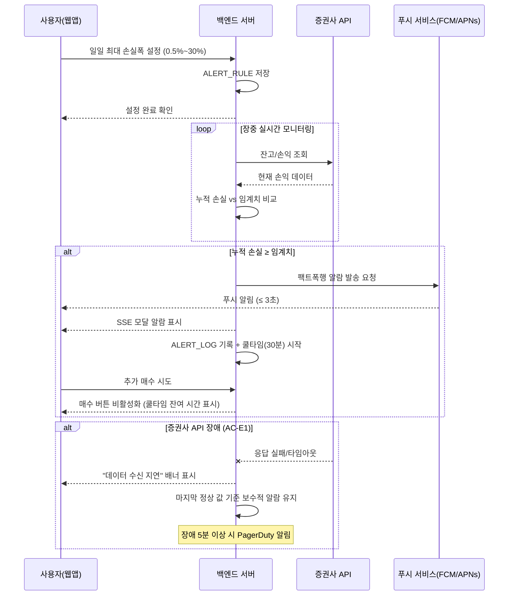
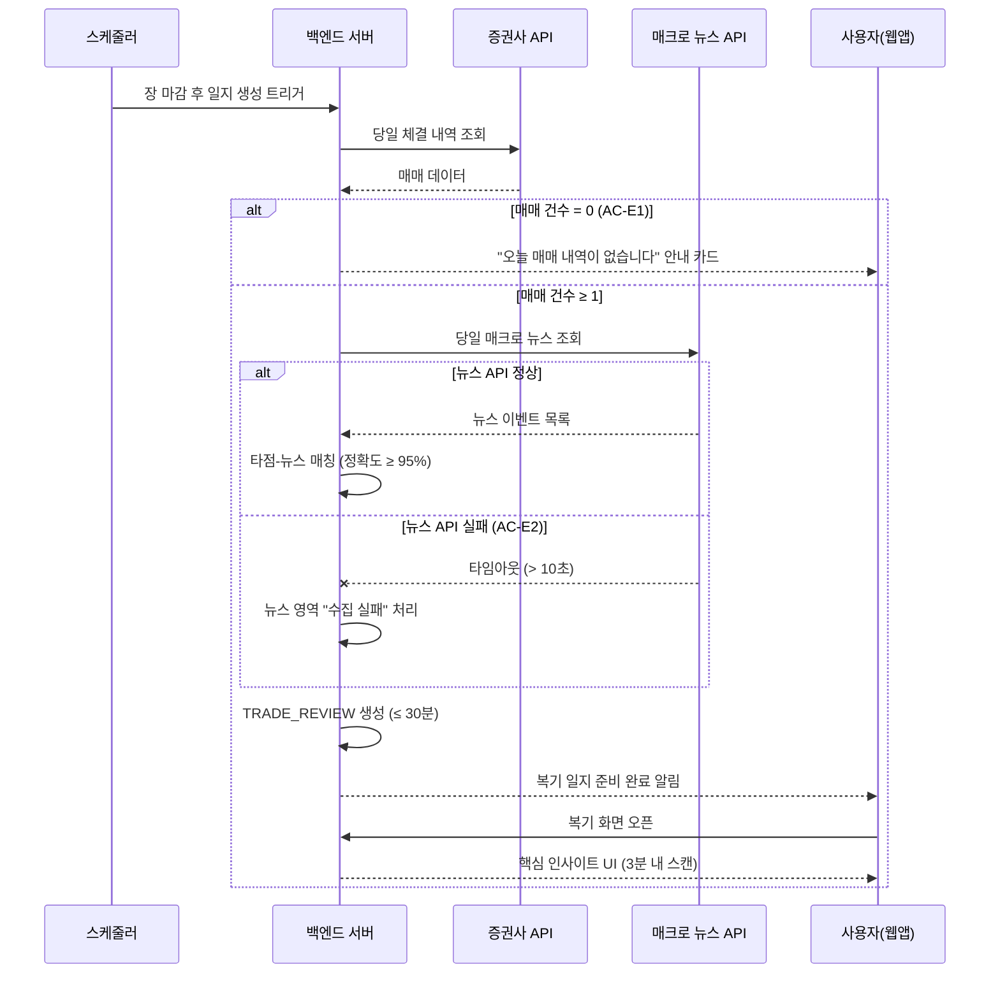
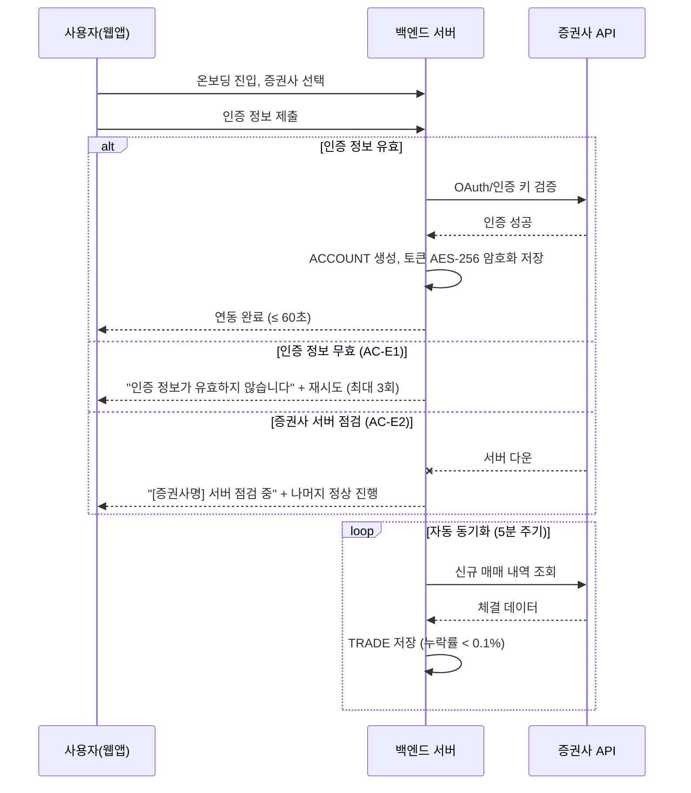
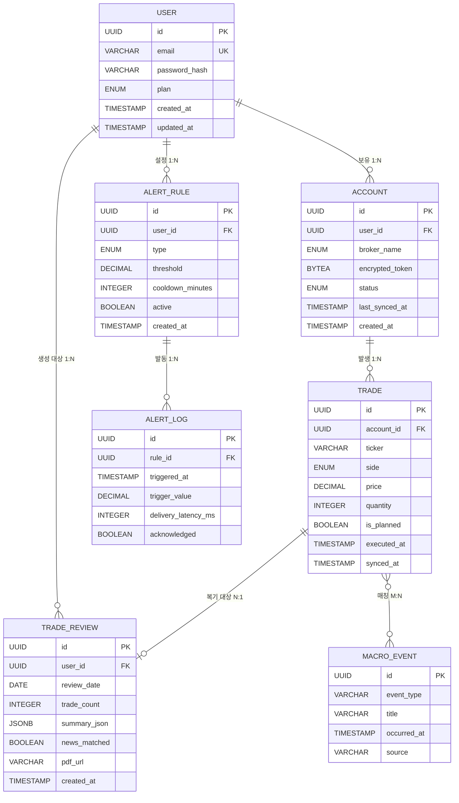
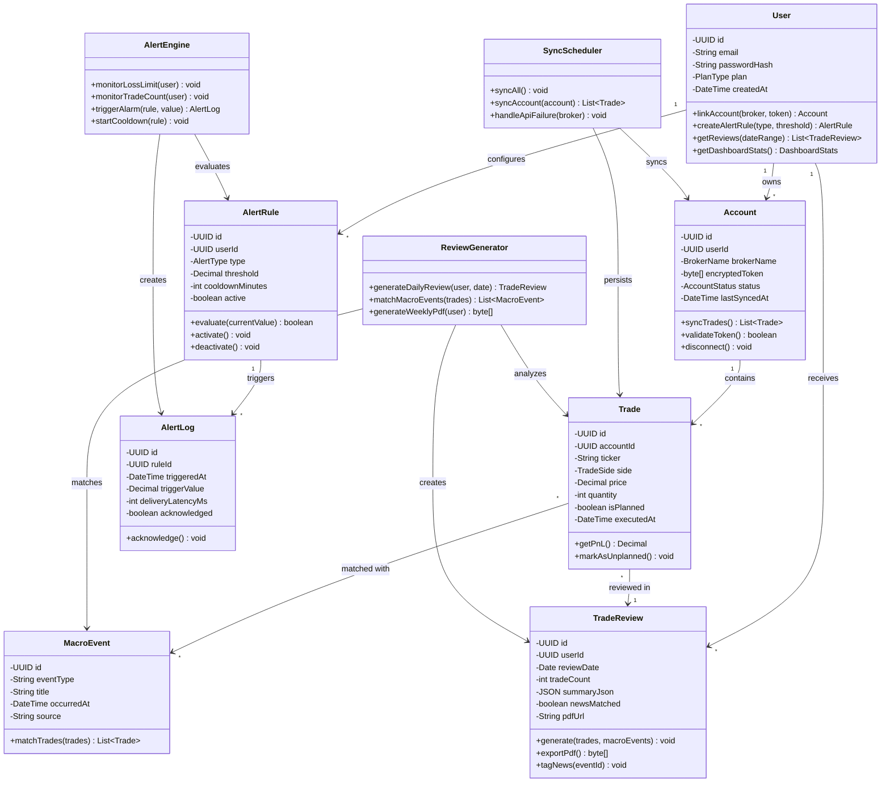

# Software Requirements Specification (SRS)

- **Document ID:** SRS-001
- **Revision:** 1.0
- **Date:** 2026-04-28
- **Standard:** ISO/IEC/IEEE 29148:2018

---

## 1. Introduction

### 1.1 Purpose

본 SRS는 **감정 제어 투자 SaaS**의 소프트웨어 요구사항을 정의한다. 데이터 기반 투자를 지향하는 개인 투자자가 영상 시청 후 실전 적용 단계에서 **스스로 검증·시뮬레이션할 수 있는 디지털 도구가 부재**하여 감정적 매매를 반복하는 문제를 해결한다.

본 문서는 개발팀, QA, 프로젝트 관리자, 이해관계자 간 요구사항 합의의 단일 원천(Single Source of Truth)으로 사용되며, ISO/IEC/IEEE 29148:2018 표준을 준수한다.

### 1.2 Scope

#### In-Scope (MVP v1)

| ID | 범위 항목 |
|---|---|
| S-IN-01 | F1. 뇌동매매 방지 강제 제어 (일일 최대 손실폭 알람, 쿨타임) |
| S-IN-02 | F2. 멀티 증권사 API 통합 연동 (키움·토스·NH) |
| S-IN-03 | F3. 자동 매매 복기 일지 (타점+차트+뉴스 매칭) |
| S-IN-04 | F5. 통계 대시보드 + 매매횟수 브레이크 |
| S-IN-05 | 웹 앱 (반응형) |

#### Out-of-Scope

| ID | 범위 항목 | 시점 |
|---|---|---|
| S-OUT-01 | F4. 노코드 백테스트/시그널 알람 | Phase 2 |
| S-OUT-02 | F6. 24h 파생/코인 타점 모니터링 | Phase 2 |
| S-OUT-03 | F7. 프리미엄 3분 요약 브리핑 | Phase 3 |
| S-OUT-04 | 자동 주문 집행 | 규제 이슈로 보류 |
| S-OUT-05 | 네이티브 모바일 앱 | 향후 |

#### Constraints / Assumptions

| 유형 | ID | 내용 | Kill Criteria | 대응 |
|---|---|---|---|---|
| 가정 | ASMP-01 | SOM 3,000~5,000명의 '각성적 학습자'는 월 5만 원 WTP 보유 | Closed Beta(n=300) 유료 전환율 < 3% 또는 Van Westendorp 적정가격 < 2만 원 | 가격 피벗 또는 B2B 모델 전환 |
| 가정 | ASMP-02 | 키움·토스·NH 3사가 타겟 사용자의 80% 이상 커버 | Beta 중 미지원 증권사 요청 > 30% | 삼성·미래에셋 API 연동 Sprint 4 내 추가 |
| 의존성 | DEP-01 | 증권사 Open API 안정적 제공 | API 가용률 < 95% (월간) | CSV 수동 업로드 폴백 UI 배포 |
| 의존성 | DEP-02 | FRED/Statista 데이터 API 가용성 | 데이터 지연 > 1시간 | KRX 공시 대안 파이프라인 구축 |
| 제약 | CNST-01 | ADR-001: 증권사 연동은 공식 API 우선, 스크래핑 폴백 | — | 법률 자문 사전 확보 |
| 제약 | CNST-02 | ADR-002: 알람 아키텍처는 SSE(서버 사이드 이벤트) 기반 | Phase 2 양방향 통신 필요 시 | WebSocket 마이그레이션 |
| 제약 | CNST-03 | ADR-003: 매매 일지는 클라우드 중앙 저장(PostgreSQL + S3) | — | at-rest AES-256 + row-level security |
| 리스크 | RISK-01 | 증권사 API 정책 변경/제한 (확률: 중, 영향: 치명) | — | 스크래핑 폴백 + 복수 증권사 의존도 분산 |
| 리스크 | RISK-02 | 금융 규제 유사투자자문 (확률: 중, 영향: 치명) | — | 법률 자문 + '정보 제공' vs '자문' 경계 명확화 |
| 리스크 | RISK-03 | 보안 사고 계좌 정보 유출 (확률: 하, 영향: 치명) | — | ISMS 인증 + 분기 침투 테스트 + 버그바운티 |
| 리스크 | RISK-04 | Cold Start 초기 유저 확보 난항 (확률: 중, 영향: 상) | — | 무료 팩트폭행 리포트 바이럴 유입 |

### 1.3 Definitions, Acronyms, Abbreviations

| 용어 | 정의 |
|---|---|
| 뇌동매매 | 사전 계획 없이 감정(공포·탐욕)에 의해 실행하는 충동적 매매 |
| 팩트폭행 알람 | 사용자의 손실 현황을 직관적 수치로 강제 노출하는 경고 알림 |
| 쿨타임 | 알람 발동 후 추가 매수를 차단하는 강제 대기 시간(최소 30분) |
| AOS | Adjusted Opportunity Score — Importance × (1 - Satisfaction / 5) |
| DOS | Discovered Opportunity Score — JTBD 인터뷰 기반 발견 기회 점수 |
| JTBD | Jobs to be Done — 고객이 특정 상황에서 완수하려는 과업 |
| MDD | Maximum Drawdown — 최대 낙폭 |
| SSE | Server-Sent Events — 서버→클라이언트 단방향 실시간 이벤트 전송 |
| WTP | Willingness to Pay — 지불 의사 금액 |
| SOM | Serviceable Obtainable Market — 실제 확보 가능 시장 |
| MoSCoW | Must / Should / Could / Won't 우선순위 분류 체계 |
| WAU | Weekly Active Users — 주간 활성 사용자 |
| NPS | Net Promoter Score — 순추천지수 |
| RPO | Recovery Point Objective — 복구 시점 목표 |
| RTO | Recovery Time Objective — 복구 시간 목표 |
| RBAC | Role-Based Access Control — 역할 기반 접근 제어 |
| PKCE | Proof Key for Code Exchange — OAuth 2.0 보안 확장 |
| FCM | Firebase Cloud Messaging — Google 푸시 알림 서비스 |
| APNs | Apple Push Notification service — Apple 푸시 알림 서비스 |

### 1.4 References

| ID | 출처 |
|---|---|
| REF-01 | 한국예탁결제원 (2024.12) — 개인투자자 1,423만 명 |
| REF-02 | 금융감독원·경찰청 — 불법 리딩방 피해액 1.3조 원, 1.4만 건 |
| REF-03 | Forbes Korea — 크리에이터 이코노미 동향 (1인 미디어 약 5조 원) |
| REF-04 | 자본시장연구원(KCMI) — 핀플루언서 편향적 정보 확산과 개인 투자자 행동 변화 |
| REF-05 | 유튜브 멤버십 통계(Playboard) — 금융 카테고리 월 3~12만 원 고단가 구독 |
| REF-06 | JTBD 가상 심층 인터뷰 (김민수·박성진·강현우) — AOS/DOS 산출 결과 |
| REF-07 | AOS 12종 페르소나 매트릭스 — Q1 혁신기회 7인 선별 |
| REF-08 | Lenny's Newsletter (2025) — SaaS D7 리텐션 업계 평균 20% |
| REF-09 | OpenView (2025) — Freemium 무료→유료 전환율 평균 3~5% |
| REF-10 | Retently (2025) — 핀테크 NPS 업계 평균 30 |
| REF-11 | Panko (2008) — 스프레드시트 오류 연구 |
| REF-12 | Thaler & Sunstein (2008) — 넛지(Nudge) 행동경제학 |
| REF-13 | ISO/IEC/IEEE 29148:2018 — Systems and software engineering — Life cycle processes — Requirements engineering |

---

## 2. Stakeholders

| 역할 (Role) | 페르소나 | 책임 (Responsibility) | 관심사 (Interest) |
|---|---|---|---|
| Primary User — 충동 매매 제어형 | 김민수 (34세, IT영업, AOS 4.0) | 일일 최대 손실폭 설정, 알람 수신 후 매매 중단 | 주간 뇌동매매 0회 달성, 계좌 반토막 방지 |
| Primary User — 자동 복기형 | 박성진 (41세, 공기업, AOS 3.2) | 증권사 계좌 연동, 복기 일지 확인 | 퇴근 후 3분 내 매매 복기, 수기 입력 0건 |
| Primary User — 승률 검증형 | 이지현 (29세, 마케터, AOS 3.0) | 매매 통계 조회, 전략 검증 | 승률 기반 의사결정 |
| Primary User — 매매횟수 억제형 | 최윤아 (36세, 프리랜서, AOS 3.0) | 매매횟수 브레이크 설정, 대시보드 모니터링 | 일일 매매 횟수 50% 감축 |
| Primary User — 통계 시각화형 | 정태호 (45세, 자영업, AOS 2.4) | 통계 대시보드 활용, 리포트 조회 | 직관적 손익 현황 파악 |
| Adjacent User (Phase 2) | 강현우 (27세, 전업 코인, AOS 2.4) | 24h 모니터링 활용 | 실시간 파생/코인 타점 알림 |
| Product Owner | Product 팀 | PRD 정의, 우선순위 결정, 실험 설계 | PMF 달성, 북극성 KPI 충족 |
| Development Team | Engineering 팀 | 시스템 설계, 구현, 테스트 | 기술 실현 가능성, 코드 품질 |
| Operations | DevOps/SRE | 모니터링, 인프라 운영, 장애 대응 | SLA 99.5%, 비용 효율 |

### 2.1 Use Case Diagram

페르소나별 시스템 상호작용을 도식화한다.

---

## 3. System Context and Interfaces

### 3.0 Component Diagram

외부 시스템과 내부 서비스 간의 아키텍처 의존성을 도식화한다.

### 3.1 External Systems

| 시스템 | 유형 | 프로토콜 | 용도 | 제약 |
|---|---|---|---|---|
| 키움 Open API | 증권사 API | REST + OAuth | 체결 내역, 잔고 조회 | 호출 제한 1회/초 |
| 토스 증권 API | 증권사 API | REST + 인증 키 | 거래 내역 조회 | 일 5,000회 |
| NH 나무 API | 증권사 API | REST + 인증 키 | 거래 내역 조회 | 일 10,000회 |
| FCM (Firebase Cloud Messaging) | 푸시 서비스 | HTTP/2 | Android/웹 푸시 알림 | 지연 ≤ 1초 |
| APNs (Apple Push Notification) | 푸시 서비스 | HTTP/2 | iOS 푸시 알림 | 지연 ≤ 1초 |
| Mixpanel | 분석 플랫폼 | REST | 이벤트 추적, 코호트 분석 | — |
| Stripe | 결제 플랫폼 | REST | 구독 결제 처리 | PCI DSS 준수 |
| PagerDuty | 장애 알림 | REST/Webhook | 운영 장애 에스컬레이션 | — |
| Delighted | NPS 서베이 | REST | 분기별 인앱 NPS 조사 | — |
| AWS (S3, RDS, Cost Explorer) | 클라우드 인프라 | — | 데이터 저장, DB, 비용 추적 | — |

### 3.2 Client Applications

| 클라이언트 | 플랫폼 | 설명 |
|---|---|---|
| 웹 앱 (반응형) | 브라우저 (Chrome, Safari, Firefox, Edge) | MVP v1 유일 클라이언트. 모바일 반응형 지원. |

### 3.3 API Overview

| API Endpoint 그룹 | 방향 | 설명 |
|---|---|---|
| `/api/v1/auth/*` | 클라이언트 → 서버 | 인증/인가 (OAuth 2.0 PKCE) |
| `/api/v1/accounts/*` | 클라이언트 ↔ 서버 ↔ 증권사 | 증권사 계좌 연동, 동기화 |
| `/api/v1/trades/*` | 서버 → 클라이언트 | 매매 내역 조회, 통합 |
| `/api/v1/alerts/*` | 클라이언트 ↔ 서버 | 알람 규칙 CRUD, 발동 이력 |
| `/api/v1/reviews/*` | 서버 → 클라이언트 | 자동 매매 복기 일지 |
| `/api/v1/dashboard/*` | 서버 → 클라이언트 | 통계 대시보드 데이터 |
| `/api/v1/reports/*` | 서버 → 클라이언트 | 주간/월간 리포트, PDF |
| `/sse/alerts` | 서버 → 클라이언트 (SSE) | 실시간 알람 스트리밍 |
| 내부: 매크로 뉴스 API | 내부 서비스 | 날짜/시간 기반 뉴스 이벤트 매칭 |

### 3.4 Interaction Sequences (핵심 시퀀스 다이어그램)

#### 3.4.1 뇌동매매 방지 알람 흐름

#### 3.4.2 자동 매매 복기 일지 생성 흐름

#### 3.4.3 멀티 증권사 통합 연동 흐름

---

## 4. Specific Requirements

### 4.1 Functional Requirements

#### 4.1.1 F1 — 뇌동매매 방지 강제 제어

| ID | 요구사항 | Source | Priority | Acceptance Criteria |
|---|---|---|---|---|
| REQ-FUNC-001 | 시스템은 사용자가 일일 최대 손실폭을 슬라이더(0.5%~30%)로 설정할 수 있는 인터페이스를 제공해야 한다. | Story 1 | Must | **Given** 사용자가 알람 설정 화면에 진입, **When** 슬라이더로 손실폭 선택 후 저장, **Then** ALERT_RULE 생성 + 확인 메시지 표시. |
| REQ-FUNC-002 | 시스템은 0.5% 미만 또는 30% 초과 값 입력 시 즉시 거부하고 인라인 에러 메시지를 표시해야 한다. | Story 1 (AC-E2) | Must | **Given** 손실폭 입력 시, **When** 범위 외 값 입력, **Then** 입력 거부 + 인라인 에러 표시. 우회율 0%. |
| REQ-FUNC-003 | 시스템은 장중 실시간으로 누적 손실을 모니터링하고, 임계치 도달 시 3초 이내 팩트폭행 알람(푸시+모달)을 발동해야 한다. | Story 1 (AC1) | Must | **Given** 손실폭 설정 상태, **When** 누적 손실 >= 설정값, **Then** 3초 이내 푸시+모달 발동. 실패율 < 0.5%. |
| REQ-FUNC-004 | 알람 발동 후 최소 30분 쿨타임 동안 매수 버튼을 비활성화해야 한다. | Story 1 (AC2) | Must | **Given** 알람 발동, **When** 쿨타임 내 매수 시도, **Then** 매수 버튼 비활성화 + 잔여 시간 표시. 우회율 < 1%. |
| REQ-FUNC-005 | 주간 종료 시 뇌동매매 리포트(계획외 매매 횟수·손실액)를 자동 생성·발송해야 한다. | Story 1 (AC3) | Must | **Given** 주간 종료, **When** 리포트 생성 실행, **Then** 자동 집계 리포트 발송. 정확도 >= 99%. |
| REQ-FUNC-006 | 증권사 API 장애 시 데이터 수신 지연 배너 + 마지막 정상 값 기준 보수적 알람 유지. 장애 5분 이상 시 PagerDuty 알림. | Story 1 (AC-E1) | Must | **Given** API 장애, **When** 손실폭 계산 실패, **Then** 배너 표시 + 폴백 알람 10초 이내. 장애 미통지율 0%. |

#### 4.1.2 F2 — 멀티 증권사 API 통합 연동

| ID | 요구사항 | Source | Priority | Acceptance Criteria |
|---|---|---|---|---|
| REQ-FUNC-007 | 온보딩에서 키움·토스·NH 증권사 선택 및 OAuth/인증 키 계좌 연동. 소요 시간 60초 이내. | Story 3 (AC1) | Must | **Given** 온보딩 진입, **When** 증권사 선택 후 인증 제출, **Then** 60초 이내 연동 완료. 성공률 >= 98%. |
| REQ-FUNC-008 | 연동 완료 후 신규 매매 발생 시 5분 이내 자동 동기화. | Story 3 (AC2) | Must | **Given** 연동 완료, **When** 신규 매매 발생, **Then** 5분 이내 동기화. 누락률 < 0.1%. |
| REQ-FUNC-009 | 복수 증권사 연동 시 전 계좌 합산 포지션·손익을 통합 대시보드에 표시. | Story 3 (AC3) | Must | **Given** 복수 증권사 연동, **When** 통합 대시보드 조회, **Then** 합산 표시. 정합성 >= 99.9%. |
| REQ-FUNC-010 | 잘못된 인증 정보 시 2초 이내 에러 메시지 + 최대 3회 재시도 허용. | Story 3 (AC-E1) | Must | **Given** 무효 인증 정보, **When** 연동 인증 요청, **Then** 2초 이내 에러 + 3회 재시도. |
| REQ-FUNC-011 | 특정 증권사 API 점검 시 30초 이내 장애 감지, 안내 표시, 나머지 증권사 정상 진행. | Story 3 (AC-E2) | Must | **Given** 증권사 서버 다운, **When** 연동 시도, **Then** 점검 안내 + 나머지 정상. 정상 증권사 영향 0%. |
| REQ-FUNC-012 | 증권사 API 토큰을 AES-256으로 암호화 저장. | ADR-003 | Must | **Given** 인증 완료, **When** 토큰 저장, **Then** AES-256 at-rest 암호화 적용. |

#### 4.1.3 F3 — 자동 매매 복기 일지

| ID | 요구사항 | Source | Priority | Acceptance Criteria |
|---|---|---|---|---|
| REQ-FUNC-013 | 장 마감 후 30분 이내 당일 매매 타점+차트+매크로 뉴스 매칭 자동 복기 일지 생성. | Story 2 (AC1) | Must | **Given** API 연동 완료, **When** 장 마감 후 30분 이내, **Then** TRADE_REVIEW 생성. 매칭 정확도 >= 95%. |
| REQ-FUNC-014 | 복기 화면은 3분 이내 핵심 인사이트 스캔 가능한 UI 제공. | Story 2 (AC2) | Must | **Given** 일지 생성 완료, **When** 복기 화면 오픈, **Then** 3분 이내(p50) 스캔 가능. |
| REQ-FUNC-015 | 주간 종합 복기 PDF를 10초 이내 생성·다운로드. | Story 2 (AC3) | Must | **Given** 주말 시점, **When** PDF 추출 요청, **Then** 10초 이내 생성. 실패율 < 1%. |
| REQ-FUNC-016 | 당일 매매 0건 시 안내 카드 표시, 빈 일지 미생성. | Story 2 (AC-E1) | Must | **Given** 매매 0건, **When** 일지 트리거, **Then** 안내 카드만 표시. 빈 일지 오생성율 0%. |
| REQ-FUNC-017 | 뉴스 API 실패(타임아웃 > 10초) 시 수집 실패 — 수동 태깅 가능 표시, 나머지 정상 생성. | Story 2 (AC-E2) | Must | **Given** 뉴스 API 실패, **When** 매칭 시도, **Then** 부분 실패 처리 + 나머지 정상. 전체 미생성율 0%. |

#### 4.1.4 F5 — 통계 대시보드 + 매매횟수 브레이크

| ID | 요구사항 | Source | Priority | Acceptance Criteria |
|---|---|---|---|---|
| REQ-FUNC-018 | 대시보드에 승률·MDD·매매횟수 등 핵심 통계 시각화. 로딩 p95 <= 2초. | Story 4 (AC1) | Must | **Given** 대시보드 접속, **When** 로딩, **Then** 통계 시각화. 로딩 <= 2초 (p95, 동시 500명). |
| REQ-FUNC-019 | 일일 매매 횟수 상한 설정 인터페이스 제공. | Story 4 | Must | **Given** 브레이크 설정 화면, **When** 상한 입력 저장, **Then** ALERT_RULE(trade_count_limit) 생성. |
| REQ-FUNC-020 | 상한 도달 시 3초 이내 강제 휴식 알림 + 매매 쿨다운 적용. | Story 4 (AC2) | Must | **Given** 상한 설정, **When** 상한 도달, **Then** 3초 이내 알림 + 쿨다운. |
| REQ-FUNC-021 | 월말 시점 전월 대비 매매 횟수·충동 매매 비율 비교 월간 리포트 자동 생성. | Story 4 (AC3) | Must | **Given** 월말 시점, **When** 리포트 생성, **Then** 전월 대비 비교 리포트. 정확도 >= 99%. |
| REQ-FUNC-022 | 30일 미만 신규 유저: 데이터 축적 중 (현재 N일치) 안내 + 가용 기간 한정 통계 표시. | Story 4 (AC-E1) | Must | **Given** 데이터 30일 미만, **When** 대시보드 조회, **Then** 안내 + 제한 통계. 빈 대시보드 에러율 0%. |

### 4.2 Non-Functional Requirements

#### 4.2.1 성능 (Performance)

| ID | 요구사항 | 측정 조건 | Source |
|---|---|---|---|
| REQ-NF-001 | 대시보드 API p95 응답 <= 500ms | 동시 500명, k6 ramp-up 10분 | PRD S5 |
| REQ-NF-002 | 알람 발동 p99 지연 <= 3초 | 동시 500명 | PRD S5, Story 1 |
| REQ-NF-003 | 대시보드 페이지 로딩 p95 <= 2초 | 동시 500명 | Story 4 |
| REQ-NF-004 | 증권사 동기화 지연 <= 5분 | 신규 매매 후 | Story 3 |
| REQ-NF-005 | 계좌 연동 소요 <= 60초 | 최초 연동 시 | Story 3 |
| REQ-NF-006 | 복기 일지 생성 완료 <= 30분 | 장 마감 후 | Story 2 |
| REQ-NF-007 | PDF 생성 <= 10초 | 주간 복기 PDF | Story 2 |
| REQ-NF-008 | 폴백 알람 발동 <= 10초 | API 장애 시 | Story 1 |

#### 4.2.2 확장성 (Scalability)

| ID | 요구사항 | 측정 조건 | Source |
|---|---|---|---|
| REQ-NF-009 | 동시 2,000명까지 p95 <= 1초 유지 | SOM 5,000 x 피크 0.4 | PRD S5 |
| REQ-NF-010 | SSE 연결당 메모리 < 1KB | 동시 2,000 연결 | ADR-002 |

#### 4.2.3 가용성 / 신뢰성 (Availability / Reliability)

| ID | 요구사항 | 측정 조건 | Source |
|---|---|---|---|
| REQ-NF-011 | 월 가용성 >= 99.5% (다운타임 <= 3.6시간/월) | UptimeRobot 모니터링 | PRD S5 |
| REQ-NF-012 | 동기화 오류율 <= 0.1% | 월간 건수 대비 | PRD S5 |
| REQ-NF-013 | 알람 발동 실패율 < 0.5% | 전체 건수 대비 | Story 1 |
| REQ-NF-014 | 뇌동매매 리포트 정확도 >= 99% | 주간 리포트 대비 | Story 1 |
| REQ-NF-015 | 타점-뉴스 매칭 정확도 >= 95% | 복기 일지 건수 대비 | Story 2 |
| REQ-NF-016 | 통합 대시보드 정합성 >= 99.9% | 복수 증권사 합산 | Story 3 |

#### 4.2.4 보안 (Security)

| ID | 요구사항 | 측정 조건 | Source |
|---|---|---|---|
| REQ-NF-017 | API 토큰 AES-256 at-rest 암호화 | 모든 encrypted_token | PRD S5, ADR-003 |
| REQ-NF-018 | 전 API 통신 TLS 1.3 in-transit 암호화 | 전체 HTTP 트래픽 | PRD S5 |
| REQ-NF-019 | OAuth 2.0 PKCE 인증 프로토콜 | 인증 흐름 전체 | PRD S5 |
| REQ-NF-020 | Row-Level Security 사용자별 데이터 격리 | PostgreSQL RLS | ADR-003 |
| REQ-NF-021 | 분기 1회 3rd-party 침투 테스트 | 외부 보안 업체 | PRD S5 |
| REQ-NF-022 | 연 1회 ISMS 갱신 심사 | 인증 기관 | PRD S5 |
| REQ-NF-023 | RBAC 관리자/일반 사용자 권한 분리 | 전체 API 엔드포인트 | ISO 29148 |

#### 4.2.5 비용 (Cost)

| ID | 요구사항 | 측정 조건 | Source |
|---|---|---|---|
| REQ-NF-024 | 사용자당 월 인프라 비용 <= 5,000원 | AWS Cost Explorer 월간 | PRD S5 |
| REQ-NF-025 | 인프라 마진 >= 90% | 구독 매출 대비 | PRD S5 |

#### 4.2.6 운영 / 모니터링 (Observability)

| ID | 요구사항 | Warning | Critical | 알림 채널 | Source |
|---|---|---|---|---|---|
| REQ-NF-026 | API p95 latency 모니터링 | > 500ms (5분) | > 1,000ms (2분) | Slack #ops -> PagerDuty | PRD S5 |
| REQ-NF-027 | 5xx 에러율 모니터링 | > 0.5% (5분) | > 1% (2분) | PagerDuty 즉시 | PRD S5 |
| REQ-NF-028 | 증권사 동기화 지연 모니터링 | > 300초 | > 600초 | Slack #data-pipeline | PRD S5 |
| REQ-NF-029 | 알람 발동 실패율 모니터링 | > 0.3% | > 0.5% | PagerDuty 즉시 | PRD S5 |
| REQ-NF-030 | 사용자당 월 비용 모니터링 | > 4,000원 | > 5,000원 | Slack #finance 일간 | PRD S5 |

#### 4.2.7 유지보수성 (Maintainability)

| ID | 요구사항 | 측정 조건 | Source |
|---|---|---|---|
| REQ-NF-031 | SSE 전송 계층 추상화 (Phase 2 WebSocket 마이그레이션 대비) | 인터페이스 분리 설계 검증 | ADR-002 |
| REQ-NF-032 | 신규 증권사 어댑터 패턴 확장 (기존 코드 변경 없이) | 4순위 증권사 추가 시 측정 | ADR-001 |

#### 4.2.8 비즈니스 KPI

| ID | 요구사항 | 기준선 | 목표값 | 측정 주기 | 측정 경로 | Source |
|---|---|---|---|---|---|---|
| REQ-NF-033 | WAU 중 주간 뇌동매매 0회 유저 비율 (북극성) | 0% | >= 40% | 주간 | Mixpanel unplanned_trade_count==0 / WAU | PRD S1-3 |
| REQ-NF-034 | D7 리텐션 | 20% | >= 35% | 주간 | Mixpanel 코호트 D0 vs D7 | PRD S1-3 |
| REQ-NF-035 | 무료->유료 전환율 | 3~5% | >= 8% | 월간 | Stripe subscription_created / signup | PRD S1-3 |
| REQ-NF-036 | 평균 복기 시간 | 30분 | <= 3분 (p50) | 월간 | review_session_duration 중앙값 | PRD S1-3 |
| REQ-NF-037 | NPS | 30 | >= 50 | 분기 | Delighted 인앱 서베이 | PRD S1-3 |

---

## 5. Traceability Matrix

| Story / Feature | Requirement ID | Test Case ID | Priority |
|---|---|---|---|
| Story 1 — 뇌동매매 방지 (F1) | REQ-FUNC-001 | TC-FUNC-001 | Must |
| Story 1 (AC-E2) | REQ-FUNC-002 | TC-FUNC-002 | Must |
| Story 1 (AC1) | REQ-FUNC-003 | TC-FUNC-003 | Must |
| Story 1 (AC2) | REQ-FUNC-004 | TC-FUNC-004 | Must |
| Story 1 (AC3) | REQ-FUNC-005 | TC-FUNC-005 | Must |
| Story 1 (AC-E1) | REQ-FUNC-006 | TC-FUNC-006 | Must |
| Story 3 — 증권사 연동 (F2) AC1 | REQ-FUNC-007 | TC-FUNC-007 | Must |
| Story 3 (AC2) | REQ-FUNC-008 | TC-FUNC-008 | Must |
| Story 3 (AC3) | REQ-FUNC-009 | TC-FUNC-009 | Must |
| Story 3 (AC-E1) | REQ-FUNC-010 | TC-FUNC-010 | Must |
| Story 3 (AC-E2) | REQ-FUNC-011 | TC-FUNC-011 | Must |
| ADR-003 보안 | REQ-FUNC-012 | TC-FUNC-012 | Must |
| Story 2 — 복기 일지 (F3) AC1 | REQ-FUNC-013 | TC-FUNC-013 | Must |
| Story 2 (AC2) | REQ-FUNC-014 | TC-FUNC-014 | Must |
| Story 2 (AC3) | REQ-FUNC-015 | TC-FUNC-015 | Must |
| Story 2 (AC-E1) | REQ-FUNC-016 | TC-FUNC-016 | Must |
| Story 2 (AC-E2) | REQ-FUNC-017 | TC-FUNC-017 | Must |
| Story 4 — 대시보드 (F5) AC1 | REQ-FUNC-018 | TC-FUNC-018 | Must |
| Story 4 | REQ-FUNC-019 | TC-FUNC-019 | Must |
| Story 4 (AC2) | REQ-FUNC-020 | TC-FUNC-020 | Must |
| Story 4 (AC3) | REQ-FUNC-021 | TC-FUNC-021 | Must |
| Story 4 (AC-E1) | REQ-FUNC-022 | TC-FUNC-022 | Must |
| PRD S5 성능 | REQ-NF-001 ~ REQ-NF-008 | TC-NF-001 ~ TC-NF-008 | Must |
| PRD S5 확장성 | REQ-NF-009, REQ-NF-010 | TC-NF-009, TC-NF-010 | Must |
| PRD S5 가용성 | REQ-NF-011 ~ REQ-NF-016 | TC-NF-011 ~ TC-NF-016 | Must |
| PRD S5 보안 | REQ-NF-017 ~ REQ-NF-023 | TC-NF-017 ~ TC-NF-023 | Must |
| PRD S5 비용 | REQ-NF-024, REQ-NF-025 | TC-NF-024, TC-NF-025 | Must |
| PRD S5 모니터링 | REQ-NF-026 ~ REQ-NF-030 | TC-NF-026 ~ TC-NF-030 | Must |
| ADR-002 유지보수 | REQ-NF-031, REQ-NF-032 | TC-NF-031, TC-NF-032 | Should |
| PRD S1-3 KPI | REQ-NF-033 ~ REQ-NF-037 | TC-NF-033 ~ TC-NF-037 | Must |

---

## 6. Appendix

### 6.1 API Endpoint List

| # | Method | Endpoint | 설명 | 인증 | Rate Limit |
|---|---|---|---|---|---|
| 1 | POST | /api/v1/auth/signup | 회원가입 | — | 10/분 |
| 2 | POST | /api/v1/auth/login | 로그인 (OAuth 2.0 PKCE) | — | 10/분 |
| 3 | POST | /api/v1/auth/refresh | 토큰 갱신 | Bearer | 30/분 |
| 4 | GET | /api/v1/accounts | 연동 계좌 목록 조회 | Bearer | 60/분 |
| 5 | POST | /api/v1/accounts | 증권사 계좌 연동 | Bearer | 10/분 |
| 6 | DELETE | /api/v1/accounts/{id} | 계좌 연동 해제 | Bearer | 10/분 |
| 7 | POST | /api/v1/accounts/{id}/sync | 수동 동기화 트리거 | Bearer | 10/분 |
| 8 | GET | /api/v1/trades | 매매 내역 조회 (필터·페이징) | Bearer | 120/분 |
| 9 | GET | /api/v1/trades/{id} | 매매 상세 조회 | Bearer | 120/분 |
| 10 | GET | /api/v1/alerts/rules | 알람 규칙 목록 | Bearer | 60/분 |
| 11 | POST | /api/v1/alerts/rules | 알람 규칙 생성 (손실폭/매매횟수) | Bearer | 10/분 |
| 12 | PUT | /api/v1/alerts/rules/{id} | 알람 규칙 수정 | Bearer | 10/분 |
| 13 | DELETE | /api/v1/alerts/rules/{id} | 알람 규칙 삭제 | Bearer | 10/분 |
| 14 | GET | /api/v1/alerts/logs | 알람 발동 이력 조회 | Bearer | 60/분 |
| 15 | GET | /sse/alerts | 실시간 알람 SSE 스트림 | Bearer | 1 연결/유저 |
| 16 | GET | /api/v1/reviews | 복기 일지 목록 조회 | Bearer | 60/분 |
| 17 | GET | /api/v1/reviews/{id} | 복기 일지 상세 조회 | Bearer | 60/분 |
| 18 | POST | /api/v1/reviews/{id}/tag | 뉴스 수동 태깅 | Bearer | 30/분 |
| 19 | GET | /api/v1/dashboard/stats | 대시보드 통계 조회 | Bearer | 120/분 |
| 20 | GET | /api/v1/reports/weekly | 주간 리포트 조회 | Bearer | 10/분 |
| 21 | GET | /api/v1/reports/monthly | 월간 리포트 조회 | Bearer | 10/분 |
| 22 | GET | /api/v1/reports/{id}/pdf | PDF 다운로드 | Bearer | 5/분 |

### 6.2 Entity & Data Model

#### USER

| 필드 | 타입 | 제약 | 설명 |
|---|---|---|---|
| id | UUID (PK) | NOT NULL, UNIQUE | 사용자 고유 식별자 |
| email | VARCHAR(255) | NOT NULL, UNIQUE | 이메일 주소 |
| password_hash | VARCHAR(255) | NOT NULL | bcrypt 해시 |
| plan | ENUM('free','basic','pro') | NOT NULL, DEFAULT 'free' | 구독 플랜 |
| created_at | TIMESTAMP | NOT NULL, DEFAULT NOW() | 가입 일시 |
| updated_at | TIMESTAMP | NOT NULL | 수정 일시 |

#### ACCOUNT

| 필드 | 타입 | 제약 | 설명 |
|---|---|---|---|
| id | UUID (PK) | NOT NULL, UNIQUE | 계좌 고유 식별자 |
| user_id | UUID (FK -> USER.id) | NOT NULL | 소유 사용자 |
| broker_name | ENUM('kiwoom','toss','nh') | NOT NULL | 증권사명 |
| encrypted_token | BYTEA | NOT NULL | AES-256 암호화 토큰 |
| status | ENUM('active','inactive','error') | NOT NULL | 연동 상태 |
| last_synced_at | TIMESTAMP | NULLABLE | 마지막 동기화 시점 |
| created_at | TIMESTAMP | NOT NULL, DEFAULT NOW() | 생성 일시 |

#### TRADE

| 필드 | 타입 | 제약 | 설명 |
|---|---|---|---|
| id | UUID (PK) | NOT NULL, UNIQUE | 매매 고유 식별자 |
| account_id | UUID (FK -> ACCOUNT.id) | NOT NULL | 계좌 참조 |
| ticker | VARCHAR(20) | NOT NULL | 종목 코드 |
| side | ENUM('buy','sell') | NOT NULL | 매수/매도 구분 |
| price | DECIMAL(15,2) | NOT NULL | 체결 가격 |
| quantity | INTEGER | NOT NULL, > 0 | 체결 수량 |
| is_planned | BOOLEAN | NOT NULL, DEFAULT true | 계획된 매매 여부 |
| executed_at | TIMESTAMP | NOT NULL | 체결 일시 |
| synced_at | TIMESTAMP | NOT NULL | 동기화 시점 |

#### TRADE_REVIEW

| 필드 | 타입 | 제약 | 설명 |
|---|---|---|---|
| id | UUID (PK) | NOT NULL, UNIQUE | 복기 일지 고유 식별자 |
| user_id | UUID (FK -> USER.id) | NOT NULL | 작성 대상 사용자 |
| review_date | DATE | NOT NULL | 복기 대상 날짜 |
| trade_count | INTEGER | NOT NULL, >= 0 | 매매 건수 |
| summary_json | JSONB | NOT NULL | 핵심 인사이트 구조화 데이터 |
| news_matched | BOOLEAN | NOT NULL | 뉴스 매칭 성공 여부 |
| pdf_url | VARCHAR(512) | NULLABLE | S3 PDF 경로 |
| created_at | TIMESTAMP | NOT NULL, DEFAULT NOW() | 생성 일시 |

#### ALERT_RULE

| 필드 | 타입 | 제약 | 설명 |
|---|---|---|---|
| id | UUID (PK) | NOT NULL, UNIQUE | 규칙 고유 식별자 |
| user_id | UUID (FK -> USER.id) | NOT NULL | 설정 사용자 |
| type | ENUM('loss_limit','trade_count_limit') | NOT NULL | 알람 유형 |
| threshold | DECIMAL(5,2) | NOT NULL | 임계치 (%, 횟수) |
| cooldown_minutes | INTEGER | NOT NULL, DEFAULT 30 | 쿨타임(분) |
| active | BOOLEAN | NOT NULL, DEFAULT true | 활성화 여부 |
| created_at | TIMESTAMP | NOT NULL, DEFAULT NOW() | 생성 일시 |

#### ALERT_LOG

| 필드 | 타입 | 제약 | 설명 |
|---|---|---|---|
| id | UUID (PK) | NOT NULL, UNIQUE | 로그 고유 식별자 |
| rule_id | UUID (FK -> ALERT_RULE.id) | NOT NULL | 발동된 규칙 |
| triggered_at | TIMESTAMP | NOT NULL | 발동 시점 |
| trigger_value | DECIMAL(15,2) | NOT NULL | 발동 시점 실측값 |
| delivery_latency_ms | INTEGER | NOT NULL | 발동~수신 지연(ms) |
| acknowledged | BOOLEAN | NOT NULL, DEFAULT false | 사용자 확인 여부 |

#### MACRO_EVENT

| 필드 | 타입 | 제약 | 설명 |
|---|---|---|---|
| id | UUID (PK) | NOT NULL, UNIQUE | 이벤트 고유 식별자 |
| event_type | VARCHAR(50) | NOT NULL | 이벤트 유형 (금리, CPI 등) |
| title | VARCHAR(255) | NOT NULL | 이벤트 제목 |
| occurred_at | TIMESTAMP | NOT NULL | 발생 시점 |
| source | VARCHAR(100) | NOT NULL | 출처 |

#### 6.2.1 Entity-Relationship Diagram (ERD)

엔터티 간의 관계를 시각화한다. PRD의 ERD를 확장하여 SRS 데이터 모델의 전체 관계를 표현한다.

#### 6.2.2 Class Diagram (도메인 모델)

핵심 도메인 모델 간의 정적 구조(속성/메서드 레벨)를 도식화한다.

### 6.3 Detailed Interaction Models

#### 6.3.1 통계 대시보드 + 매매횟수 브레이크 상세 흐름

`mermaid
sequenceDiagram
    participant U as 사용자(웹앱)
    participant S as 백엔드 서버
    participant DB as PostgreSQL
    participant P as 푸시 서비스

    U->>S: GET /api/v1/dashboard/stats
    S->>DB: 승률, MDD, 매매횟수 집계 쿼리
    
    alt 데이터 >= 30일
        DB-->>S: 전체 기간 통계
        S-->>U: 핵심 통계 시각화 (p95 <= 2초)
    else 데이터 < 30일 (신규 유저)
        DB-->>S: 가용 기간 한정 통계
        S-->>U: 데이터 축적 중 (현재 N일치) + 제한 통계
    end

    U->>S: POST /api/v1/alerts/rules (type=trade_count_limit)
    S->>DB: ALERT_RULE 저장
    S-->>U: 설정 완료

    loop 장중 매매 횟수 모니터링
        S->>DB: 당일 매매 횟수 카운트
        alt 횟수 >= 상한
            S->>P: 강제 휴식 알림 발송
            P-->>U: 알림 (3초 이내)
            S-->>U: SSE 매매 쿨다운 표시
            S->>DB: ALERT_LOG 기록
        end
    end

    Note over S: 월말 시점
    S->>DB: 전월 대비 매매 횟수/충동 매매 비율 집계
    S->>S: 월간 리포트 생성 (정확도 >= 99%)
    S-->>U: 월간 리포트 알림
`

#### 6.3.2 온보딩 → 증권사 연동 → 첫 복기 일지 E2E 흐름

`mermaid
sequenceDiagram
    participant U as 사용자(웹앱)
    participant S as 백엔드 서버
    participant B as 증권사 API
    participant N as 매크로 뉴스 API
    participant SCH as 스케줄러

    rect rgb(240,248,255)
        Note over U,S: Phase 1: 온보딩 + 연동
        U->>S: POST /api/v1/auth/signup
        S-->>U: 회원가입 완료
        U->>S: POST /api/v1/accounts (broker=kiwoom)
        S->>B: OAuth 인증 검증
        B-->>S: 인증 성공
        S->>S: 토큰 AES-256 암호화 저장
        S-->>U: 계좌 연동 완료 (60초 이내)
    end

    rect rgb(255,248,240)
        Note over U,S: Phase 2: 데이터 동기화
        loop 5분 주기
            S->>B: 체결 내역 조회
            B-->>S: 매매 데이터
            S->>S: TRADE 저장 (누락률 < 0.1%)
        end
    end

    rect rgb(240,255,240)
        Note over U,S: Phase 3: 자동 복기
        SCH->>S: 장 마감 후 트리거
        S->>B: 당일 체결 내역 최종 조회
        S->>N: 매크로 뉴스 조회
        N-->>S: 뉴스 이벤트
        S->>S: 타점-뉴스 매칭 + TRADE_REVIEW 생성
        S-->>U: 복기 일지 준비 알림
        U->>S: GET /api/v1/reviews/{id}
        S-->>U: 핵심 인사이트 UI (3분 내 복기)
    end
`

#### 6.3.3 뇌동매매 방지 → 주간 리포트 전체 사이클

`mermaid
sequenceDiagram
    participant U as 사용자(웹앱)
    participant S as 백엔드 서버
    participant B as 증권사 API
    participant P as 푸시 서비스

    Note over U,S: Day 1~5: 장중 모니터링
    U->>S: 일일 최대 손실폭 -5% 설정
    S->>S: ALERT_RULE(type=loss_limit, threshold=5.0) 저장

    loop 매 거래일 장중
        S->>B: 실시간 잔고/손익 조회
        B-->>S: 손익 데이터
        S->>S: 누적 손실 계산

        alt 누적 손실 >= 5%
            S->>P: 팩트폭행 알람 발송
            P-->>U: 푸시 + 모달 (3초 이내)
            S->>S: ALERT_LOG 기록 + 쿨타임 시작
            Note over U: 30분 매수 차단
        end

        alt 당일 매매 is_planned=false 발생
            S->>S: 계획외 매매로 태깅
        end
    end

    Note over S: 주간 종료 (금요일 장 마감 후)
    S->>S: unplanned_trade_count 집계
    S->>S: weekly_loss_amount 집계
    S->>S: 주간 뇌동매매 리포트 생성 (정확도 >= 99%)
    S-->>U: 리포트 이메일/인앱 발송
    S->>S: Mixpanel 이벤트 전송 (unplanned_trade_count)
`

### 6.4 Validation Plan

| 실험 | 가설 | 대상 | 기간 | 성공 기준 | 측정 도구 |
|---|---|---|---|---|---|
| A/B 테스트: 뇌동매매 알람 ON/OFF | 알람 그룹의 주간 충동매매 횟수 유의 감소 | n=300 (150/그룹) | 2주 | 충동매매 >= 50% 감소 (p < 0.05) | unplanned_trade_count, weekly_loss_amount |
| 코호트 분석: 자동 복기 일지 사용 여부 | 일지 사용 그룹 D14 리텐션 유의 증가 | n>=200/그룹 | 4주 | D14 리텐션 >= 2배 | session_start 코호트 |
| 온보딩 퍼널: 증권사 연동 UX | 연동 완료율이 전환율 병목 | Closed Beta 전체 | 4주 | 온보딩->연동 완료 >= 70% | Mixpanel 퍼널 |
| Van Westendorp 가격 조사 | 각성적 학습자 WTP >= 월 5만 원 | n=500 | 2주 | 95% CI +-4.4%p | 지불의사금액 분포 |

---

> **문서 끝** — SRS-001 v1.0 | ISO/IEC/IEEE 29148:2018 준수

