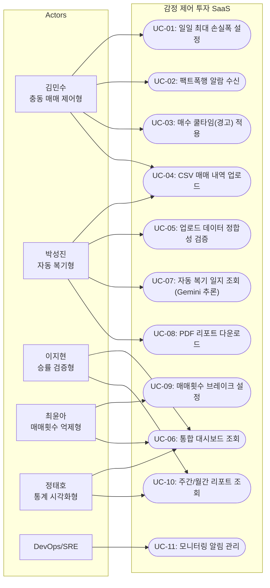
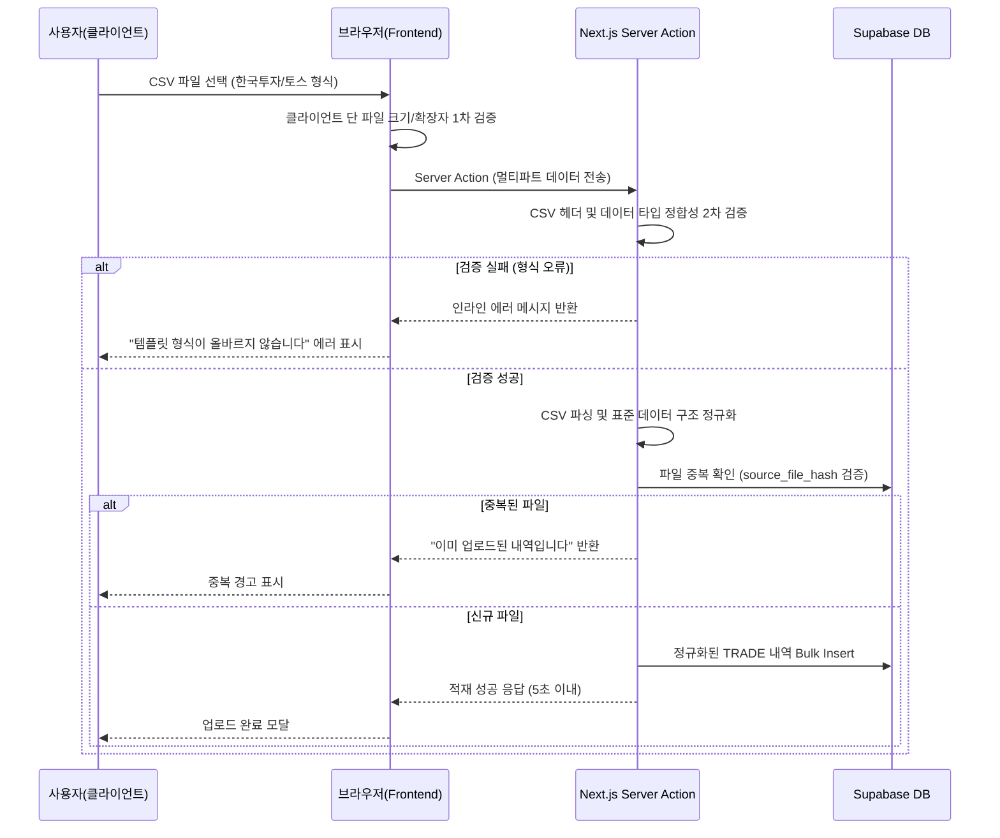
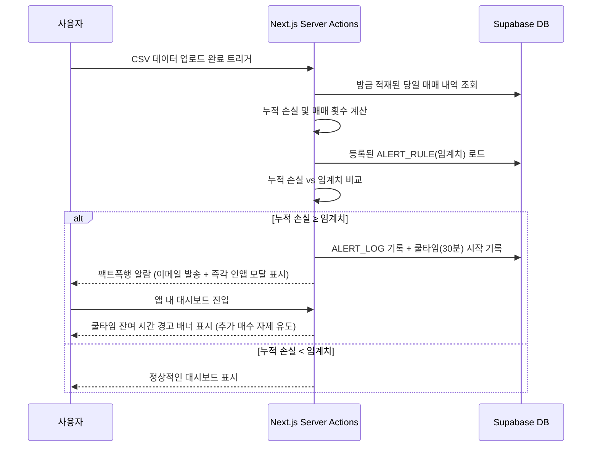
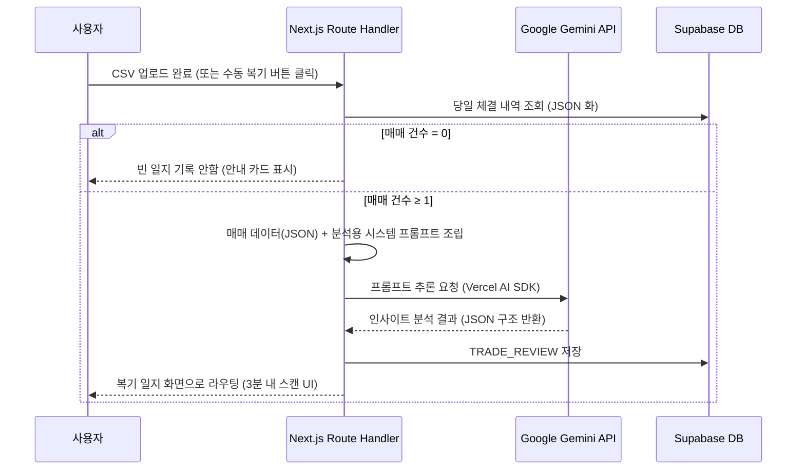
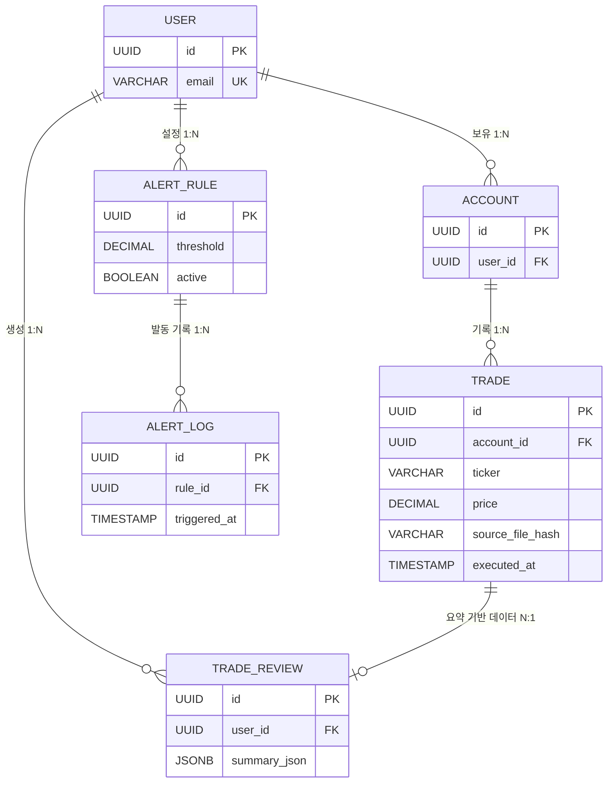
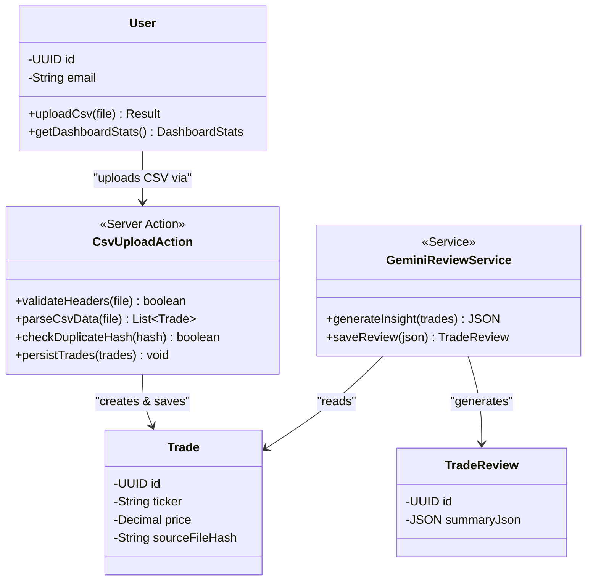

# Software Requirements Specification (SRS) - v1.2

- **Document ID:** SRS-001
- **Revision:** 1.2
- **Date:** 2026-05-02
- **Standard:** ISO/IEC/IEEE 29148:2018
- **Tech Stack:** Next.js (App Router) · Supabase · Vercel AI SDK · Google Gemini

---

## 1. Introduction

### 1.1 Purpose

본 SRS는 **감정 제어 투자 SaaS**의 소프트웨어 요구사항을 정의합니다. 데이터 기반 투자를 지향하는 개인 투자자가 영상 시청 후 실전 적용 단계에서 **스스로 검증·시뮬레이션할 수 있는 디지털 도구가 부재**하여 감정적 매매를 반복하는 문제를 해결합니다.

본 문서는 개발팀, QA, 프로젝트 관리자, 이해관계자 간 요구사항 합의의 단일 원천(Single Source of Truth)으로 사용되며, ISO/IEC/IEEE 29148:2018 표준을 준수합니다.

### 1.2 Scope

#### In-Scope (MVP v1.2)

| ID | 범위 항목 |
|---|---|
| S-IN-01 | F1. 뇌동매매 방지 강제 제어 (일일 최대 손실폭 알람, 쿨타임) |
| S-IN-02 | F2. 표준 CSV 매매 내역 업로드 및 파싱 |
| S-IN-03 | F3. 자동 매매 복기 일지 (Gemini API 기반 추론 및 요약) |
| S-IN-04 | F5. 통계 대시보드 + 매매횟수 브레이크 |
| S-IN-05 | 웹 앱 (반응형) |

#### Out-of-Scope

| ID | 범위 항목 | 시점 |
|---|---|---|
| S-OUT-01 | F4. 노코드 백테스트/시그널 알람 | Phase 2 |
| S-OUT-02 | F6. 24h 파생/코인 타점 모니터링 | Phase 2 |
| S-OUT-03 | F7. 프리미엄 3분 요약 브리핑 | Phase 3 |
| S-OUT-04 | 증권사 OpenAPI 연동을 통한 실시간 매매 자동 수집 | 현재 CSV 수동 업로드로 대체 |
| S-OUT-05 | 자동 주문 집행 | 규제 이슈로 보류 |
| S-OUT-06 | 네이티브 모바일 앱 | 향후 |

#### Constraints / Assumptions

| 유형 | ID | 내용 | Kill Criteria | 대응 |
|---|---|---|---|---|
| 가정 | ASMP-01 | SOM 3,000~5,000명의 '각성적 학습자'는 월 5만 원 WTP 보유 | Closed Beta(n=50) 유료 전환율 < 3% | 가격 피벗 또는 B2B 모델 전환 |
| 가정 | ASMP-02 | 사용자는 한국투자·토스 등의 표준 CSV 포맷 추출에 어려움을 겪지 않음 | 데이터 업로드 실패율 > 20% | 온보딩 가이드 영상/튜토리얼 강화 |
| 제약 | C-TEC-001 | 모든 서비스는 Next.js (App Router) 기반 단일 풀스택 프레임워크 구현 | — | 프론트/백엔드 단일 코드베이스 유지 |
| 제약 | C-TEC-002 | 서버 측 로직은 Next.js Server Actions / Route Handlers로 처리 | — | 별도 백엔드 없이 Vercel 배포 |
| 제약 | C-TEC-003 | DB는 로컬 SQLite 개발, 배포 시 Supabase(PostgreSQL) 사용 | — | 복잡한 인프라 설정 배제 |
| 제약 | C-TEC-004 | UI는 Tailwind CSS 및 shadcn/ui 사용으로 일관성 강제 | — | AI 코드 생성 효율성 극대화 |
| 제약 | C-TEC-006 | Vercel Pro 및 Supabase Pro 도입 (월 예산 $45 이내). 무거운 크론잡 대신 사용자 액션(CSV 업로드) 트리거 기반으로 로직 처리. | 예산 초과 | 사용량 제한 정책 도입 |
| 제약 | C-TEC-007 | 배포 및 인프라는 Vercel로 단일화 (Git Push 자동 배포) | — | CI/CD 파이프라인 수동 구축 제거 |
| 제약 | CNST-04 | 규제/컴플라이언스: 개인정보보호법 및 금융 가이드라인 준수 | 법적 리스크 발생 | 개인/신용정보 분리 보관 및 법률 자문 확보 |
| 제약 | CNST-05 | 운영 환경: 최신 모던 브라우저 및 모바일 웹(반응형) 필수 지원 | 모바일 환경 이탈률 > 30% | 반응형(Mobile-First) UI/UX 설계 |
| 리스크 | RISK-02 | 금융 규제 유사투자자문 (확률: 중, 영향: 치명) | — | 법률 자문 + '정보 제공' vs '자문' 경계 명확화 |
| 리스크 | RISK-04 | Cold Start 초기 유저 확보 난항 (확률: 중, 영향: 상) | — | 무료 팩트폭행 리포트 바이럴 유입 |

### 1.3 Definitions, Acronyms, Abbreviations

| 용어 | 정의 |
|---|---|
| 뇌동매매 | 사전 계획 없이 감정(공포·탐욕)에 의해 실행하는 충동적 매매 |
| 팩트폭행 알람 | 사용자의 손실 현황을 직관적 수치로 강제 노출하는 경고 알림 |
| 쿨타임 | 알람 발동 후 추가 매수를 억제하는 앱 내 경고 대기 시간 |
| MDD | Maximum Drawdown — 최대 낙폭 |
| MVP | Minimum Viable Product — 최소 기능 제품 |
| CSV | Comma-Separated Values — 매매 내역 업로드용 표준 데이터 파일 포맷 |
| RPO | Recovery Point Objective — 복구 시점 목표 |
| RTO | Recovery Time Objective — 복구 시간 목표 |
| BaaS | Backend as a Service — Supabase 등 관리형 백엔드 서비스 |
| RLS | Row-Level Security — PostgreSQL 행 수준 보안 정책 |

### 1.4 References

| ID | 출처 |
|---|---|
| REF-01 | 한국예탁결제원 (2024.12) — 개인투자자 1,423만 명 |
| REF-02 | 금융감독원·경찰청 — 불법 리딩방 피해액 1.3조 원, 1.4만 건 |
| REF-03 | Forbes Korea — 크리에이터 이코노미 동향 (1인 미디어 약 5조 원) |
| REF-04 | 자본시장연구원(KCMI) — 핀플루언서 편향적 정보 확산과 개인 투자자 행동 변화 |
| REF-05 | 유튜브 멤버십 통계(Playboard) — 금융 카테고리 월 3~12만 원 고단가 구독 |
| REF-06 | JTBD 가상 심층 인터뷰 (김민수·박성진·강현우) — AOS/DOS 산출 결과 |
| REF-07 | AOS 12종 페르소나 매트릭스 — Q1 혁신기회 7인 선별 |
| REF-08 | Lenny's Newsletter (2025) — SaaS D7 리텐션 업계 평균 20% |
| REF-09 | OpenView (2025) — Freemium 무료→유료 전환율 평균 3~5% |
| REF-10 | Retently (2025) — 핀테크 NPS 업계 평균 30 |
| REF-11 | Panko (2008) — 스프레드시트 오류 연구 |
| REF-12 | Thaler & Sunstein (2008) — 넛지(Nudge) 행동경제학 |
| REF-13 | ISO/IEC/IEEE 29148:2018 — Systems and software engineering — Life cycle processes — Requirements engineering |

---

## 2. Stakeholders

| 역할 (Role) | 페르소나 | 책임 (Responsibility) | 관심사 (Interest) |
|---|---|---|---|
| Primary User — 충동 매매 제어형 | 김민수 (34세, IT영업, AOS 4.0) | 일일 최대 손실폭 설정, 알람 수신 후 매매 중단 | 주간 뇌동매매 0회 달성, 계좌 반토막 방지 |
| Primary User — 자동 복기형 | 박성진 (41세, 공기업, AOS 3.2) | CSV 매매 내역 업로드, 복기 일지 확인 | 퇴근 후 3분 내 매매 복기, 수기 입력 0건 |
| Primary User — 승률 검증형 | 이지현 (29세, 마케터, AOS 3.0) | 매매 통계 조회, 전략 검증 | 승률 기반 의사결정 |
| Primary User — 매매횟수 억제형 | 최윤아 (36세, 프리랜서, AOS 3.0) | 매매횟수 브레이크 설정, 대시보드 모니터링 | 일일 매매 횟수 50% 감축 |
| Primary User — 통계 시각화형 | 정태호 (45세, 자영업, AOS 2.4) | 통계 대시보드 활용, 리포트 조회 | 직관적 손익 현황 파악 |
| Adjacent User (Phase 2) | 강현우 (27세, 전업 코인, AOS 2.4) | 24h 모니터링 활용 | 실시간 파생/코인 타점 알림 |
| Product Owner | Product 팀 | PRD 정의, 우선순위 결정, 실험 설계 | PMF 달성, 북극성 KPI 충족 |
| Development Team | Engineering 팀 | 시스템 설계, 구현, 테스트 | 기술 실현 가능성, 코드 품질 |
| Operations | DevOps/SRE | 모니터링, 인프라 운영, 장애 대응 | Best Effort 가용성, 비용 효율 |

### 2.1 Use Case Diagram

페르소나별 시스템 상호작용을 도식화합니다.



---

## 3. System Context and Interfaces

### 3.0 Component Diagram

외부 시스템과 내부 서비스 간의 아키텍처 의존성을 도식화합니다.

```mermaid
flowchart TB
    subgraph Vercel["Vercel Platform (Next.js App Router)"]
        CLIENT["Client Components<br/>(Tailwind + shadcn/ui)"]
        SERVER["Server Components & Actions<br/>(API, 파싱/로직 처리)"]
    end

    subgraph Supabase["Supabase (BaaS)"]
        PG[("PostgreSQL<br/>(DB & RLS)")]
        REALTIME["Supabase Realtime<br/>(알람)"]
        STORAGE[("Supabase Storage<br/>(CSV/PDF 파일)")]
    end

    subgraph AI["AI Layer"]
        SDK["Vercel AI SDK"]
        GEMINI["Google Gemini API<br/>(복기 일지 요약 및 타점 분석 로직 수행)"]
    end

    subgraph External["External Systems"]
        STRIPE["Stripe (결제)"]
    end

    CLIENT <-->|Server Actions (CSV 업로드)| SERVER
    CLIENT <-->|Subscribe| REALTIME
    SERVER <--> PG
    SERVER --> STORAGE
    SERVER --> REALTIME

    SERVER <--> SDK
    SDK <--> GEMINI

    SERVER <--> STRIPE
```

### 3.1 External Systems

| 시스템 | 유형 | 프로토콜 | 용도 | 제약 |
|---|---|---|---|---|
| Supabase (Pro) | BaaS | REST/WebSocket | DB(PostgreSQL), Storage, Realtime 알람 | 월 $25 과금 |
| Google Gemini API | LLM API | REST | 복기 일지 요약, 타점 분석 로직 연동 | Rate Limit 준수 |
| Vercel (Pro) | 플랫폼 | — | Next.js 배포, 서버리스 함수 | 월 $20 과금 |
| Stripe | 결제 플랫폼 | REST | 구독 결제 처리 | PCI DSS 준수 |

### 3.2 Client Applications

| 클라이언트 | 플랫폼 | 설명 |
|---|---|---|
| 웹 앱 (반응형) | 브라우저 (Chrome, Safari, Firefox, Edge) | MVP v1.2 유일 클라이언트. 모바일 반응형 지원. |

### 3.3 Server Actions / Route Handlers Overview

| 모듈/경로 | 방향 | 설명 |
|---|---|---|
| `actions/auth.ts` | 클라이언트 → 서버 | 사용자 인증 및 세션 관리 (Supabase Auth) |
| `actions/upload.ts` | 클라이언트 → 서버 | CSV 파일 업로드, 헤더 검증, 파싱 및 DB 적재 |
| `actions/trades.ts` | 클라이언트 ↔ 서버 | 매매 내역 통합 조회 |
| `actions/alerts.ts` | 클라이언트 ↔ 서버 | 알람 규칙 CRUD 및 계산 |
| `actions/reviews.ts` | 서버 → 클라이언트 | Vercel AI SDK + Gemini API 기반 자동 복기 일지 생성 (업로드 직후 트리거) |
| `actions/dashboard.ts` | 서버 → 클라이언트 | 대시보드 통계 집계 |

### 3.4 Interaction Sequences (핵심 시퀀스 다이어그램)

#### 3.4.1 CSV 파일 파싱 및 DB 적재 흐름 (멀티 증권사 연동 대체)



#### 3.4.2 데이터 업로드 즉시 당일 누적 손실 계산 및 뇌동매매 알람 발동



#### 3.4.3 프롬프트 기반 자동 매매 복기 생성 흐름 (Gemini 연동)



---

## 4. Specific Requirements

### 4.1 Functional Requirements

#### 4.1.1 F1 — 뇌동매매 방지 강제 제어

| ID | 요구사항 | Priority | Acceptance Criteria |
|---|---|---|---|
| REQ-FUNC-001 | 사용자가 일일 최대 손실폭을 슬라이더(0.5%~30%)로 설정할 수 있어야 합니다. | Must | **Given** 알람 설정 화면, **When** 손실폭 저장, **Then** ALERT_RULE 생성. |
| REQ-FUNC-002 | 0.5% 미만 또는 30% 초과 값 입력 시 인라인 에러 메시지를 표시합니다. | Must | **Given** 손실폭 입력, **When** 범위 외 값, **Then** 입력 거부. |
| REQ-FUNC-003 | 시스템은 **CSV 데이터 업로드 시점 트리거**를 통해 당일 누적 손실을 계산하고, 임계치 도달 시 이메일 및 인앱 모달 형태의 알람을 발동해야 합니다. | Must | **Given** 손실폭 설정 상태, **When** 파일 업로드 후 누적손실 >= 설정값, **Then** 즉각 알람. |
| REQ-FUNC-004 | 알람 발동 후 최소 30분 동안 대시보드에 강력한 쿨타임 시각적 경고를 표시하여 추가 매수를 억제합니다. | Must | **Given** 알람 발동, **When** 앱 탐색 시, **Then** 쿨타임 경고 고정 표시. |
| REQ-FUNC-005 | 주간 종료 시 누적된 데이터를 바탕으로 뇌동매매 자동 리포트를 생성해 이메일 발송합니다. | Must | **Given** 주말 시점, **When** 집계 스크립트 실행, **Then** 리포트 발송. |

#### 4.1.2 F2 — 표준 CSV 매매 내역 업로드 및 파싱

| ID | 요구사항 | Priority | Acceptance Criteria |
|---|---|---|---|
| REQ-FUNC-007 | 사용자는 템플릿(한국투자/토스 형식)에 맞는 CSV 파일을 업로드할 수 있어야 합니다. | Must | **Given** 업로드 화면, **When** 유효 CSV 선택 후 제출, **Then** 파싱 후 DB 적재. |
| REQ-FUNC-008 | 시스템은 업로드된 CSV의 헤더와 데이터 타입을 프론트/서버 양측에서 검증하고 오류 시 인라인 메시지를 표시해야 합니다. | Must | **Given** 파일 선택, **When** 헤더 형식 불일치, **Then** 명확한 에러 안내. |
| REQ-FUNC-009 | CSV 파일의 Hash 값을 추출하여 기존 DB와 비교, 중복 업로드를 방지해야 합니다. | Must | **Given** 동일 파일 재업로드 시도, **When** 해시 매칭, **Then** 중복 업로드 차단. |

#### 4.1.3 F3 — 자동 매매 복기 일지 (Gemini API 기반)

| ID | 요구사항 | Priority | Acceptance Criteria |
|---|---|---|---|
| REQ-FUNC-013 | Gemini API 기반 프롬프트 추론을 활용하여 업로드된 CSV 매매 데이터(JSON)를 분석하고, 타점 평가 및 요약이 포함된 복기 일지를 자동 생성해야 합니다. | Must | **Given** 데이터 적재 후, **When** AI 분석 트리거, **Then** 프롬프트 응답으로 구조화된 일지 저장. |
| REQ-FUNC-014 | 복기 화면은 3분 이내 핵심 인사이트 스캔이 가능한 대시보드 UI를 제공합니다. | Must | **Given** 복기 데이터 존재, **When** 화면 접근, **Then** 차트 및 요약글 즉시 렌더링. |
| REQ-FUNC-015 | 사용자가 원할 경우 특정 주간의 복기 내용을 요약 PDF로 추출할 수 있어야 합니다. | Should | **Given** 주간 요약 화면, **When** PDF 추출 클릭, **Then** 브라우저 내 다운로드 실행. |

#### 4.1.4 F5 — 통계 대시보드 + 매매횟수 브레이크

| ID | 요구사항 | Priority | Acceptance Criteria |
|---|---|---|---|
| REQ-FUNC-018 | 대시보드에 전체/기간별 승률·MDD·매매횟수 등을 시각화합니다. | Must | **Given** 대시보드 진입, **When** 화면 렌더링, **Then** 차트 정상 표시. |
| REQ-FUNC-019 | 일일 매매 횟수 상한 설정 인터페이스를 제공하고 업로드 시 검증합니다. | Must | **Given** 횟수 설정 화면, **When** 상한 도달, **Then** 강제 휴식 권고 알림. |

### 4.2 Non-Functional Requirements

#### 4.2.1 성능 (Performance)
* **REQ-NF-001**: 대시보드 렌더링을 위한 API p95 응답 시간은 500ms 이하를 유지한다.
* **REQ-NF-002**: 알람 감지 로직 처리 및 이메일 발송 큐 적재 시간은 데이터 파싱 완료 후 1초 이내여야 한다.
* **REQ-NF-004**: **CSV 파싱 및 정규화 데이터 DB 적재 처리 시간은 5초 이내여야 한다.** (건수 1,000건 기준)
* **REQ-NF-006**: Gemini API를 이용한 복기 일지 생성은 호출부터 응답 저장까지 30초 이내에 완료되어야 한다.

#### 4.2.2 확장성 (Scalability)
* **REQ-NF-009**: **초기 테스터 50명, 동시접속 10명 이내 환경**에서 안정적이고 빠른 퍼포먼스를 보장해야 한다. 서버리스 구조(Vercel)의 장점을 활용해 트래픽 변화에 유연하게 대응한다.

#### 4.2.3 가용성 / 신뢰성 (Availability / Reliability)
* **REQ-NF-011**: MVP 단계의 가용성 목표는 **'Best Effort'** 로 운영하며, Vercel/Supabase Pro 플랜의 SLA를 상속받는다.
* **REQ-NF-012**: 데이터 파싱 간 유실률(오류 제외 순수 누락)은 0%여야 한다.
* **REQ-NF-015**: Gemini 프롬프트 응답에 따른 JSON 파싱 실패율은 재시도 로직을 포함해 2% 미만으로 통제한다.

#### 4.2.4 보안 (Security)
* **REQ-NF-018**: 모든 HTTP 트래픽은 TLS 1.3을 통해 암호화됩니다.
* **REQ-NF-020**: Supabase Row-Level Security(RLS)를 통해 사용자 간 데이터(Account, Trade, Rule) 접근을 엄격히 격리합니다.
* **REQ-NF-023a**: 개인정보보호법(PIPA) 및 신용정보법을 준수합니다. 데이터 파기 정책 및 동의 이력 관리를 포함합니다.

#### 4.2.5 비용 (Cost)
* **REQ-NF-024**: 운영 인프라 비용은 **월 $45 이내 (Vercel Pro $20, Supabase Pro $25)** 의 예산 범위 내에서 구축합니다.

---

## 5. Traceability Matrix

| Story / Feature | Requirement ID | Test Case ID | Priority |
|---|---|---|---|
| F1 — 뇌동매매 방지 | REQ-FUNC-001 ~ 005 | TC-FUNC-001 ~ 005 | Must |
| F2 — CSV 매매 내역 업로드 | REQ-FUNC-007 ~ 009 | TC-FUNC-007 ~ 009 | Must |
| F3 — AI 자동 매매 복기 일지 | REQ-FUNC-013 ~ 015 | TC-FUNC-013 ~ 015 | Must |
| F5 — 대시보드 통계 및 알람 | REQ-FUNC-018 ~ 019 | TC-FUNC-018 ~ 019 | Must |
| NFR - 성능 / CSV 처리속도 | REQ-NF-001, 002, 004, 006 | TC-NF-001, 002, 004, 006 | Must |
| NFR - 확장성, 가용성 | REQ-NF-009, 011, 012, 015 | TC-NF-009, 011, 012, 015 | Must |
| NFR - 보안 / 컴플라이언스 | REQ-NF-018, 020, 023a | TC-NF-018, 020, 023a | Must |
| NFR - 비용 제약 목표 | REQ-NF-024 | TC-NF-024 | Must |

---

## 6. Appendix

### 6.1 API Endpoint List

*MVP 단계에서 증권사 REST 연동이 제거되었으므로, 데이터 적재는 파일 업로드 단일 채널로 통일됩니다.*

| # | Method | Endpoint | 설명 | 인증 |
|---|---|---|---|---|
| 1 | POST | /api/v1/auth/signup | 회원가입 (Supabase) | — |
| 2 | POST | /api/v1/auth/login | 로그인 | — |
| 3 | POST | `/api/v1/trades/upload` | **CSV 파일 업로드 및 파싱 (multipart/form-data)** | Bearer |
| 4 | GET | /api/v1/trades | 매매 내역 조회 | Bearer |
| 5 | GET | /api/v1/alerts/rules | 알람 규칙 목록 | Bearer |
| 6 | POST | /api/v1/alerts/rules | 알람 규칙 생성 | Bearer |
| 7 | GET | /api/v1/reviews | 복기 일지 목록 조회 | Bearer |
| 8 | POST | /api/v1/reviews/generate | Gemini API 수동 분석 트리거 | Bearer |
| 9 | GET | /api/v1/dashboard/stats | 대시보드 통계 조회 | Bearer |

### 6.2 Entity & Data Model

#### ACCOUNT (최소화)
| 필드 | 타입 | 제약 | 설명 |
|---|---|---|---|
| id | UUID (PK) | NOT NULL, UNIQUE | 계좌 식별자 |
| user_id | UUID (FK -> USER) | NOT NULL | 소유 사용자 |
| status | ENUM('active','inactive') | NOT NULL | 활성 상태 |
| created_at | TIMESTAMP | NOT NULL | 생성 일시 |

#### TRADE (CSV 업로드 이력 포함)
| 필드 | 타입 | 제약 | 설명 |
|---|---|---|---|
| id | UUID (PK) | NOT NULL, UNIQUE | 매매 고유 식별자 |
| account_id | UUID (FK -> ACCOUNT)| NOT NULL | 계좌 참조 |
| ticker | VARCHAR(20) | NOT NULL | 종목 코드 |
| side | ENUM('buy','sell') | NOT NULL | 매수/매도 구분 |
| price | DECIMAL(15,2) | NOT NULL | 체결 가격 |
| quantity | INTEGER | NOT NULL | 체결 수량 |
| `source_file_hash` | VARCHAR(64) | NOT NULL, UNIQUE | 원본 CSV 중복 방지 해시 |
| executed_at | TIMESTAMP | NOT NULL | 체결 일시 |

#### TRADE_REVIEW
| 필드 | 타입 | 제약 | 설명 |
|---|---|---|---|
| id | UUID (PK) | NOT NULL, UNIQUE | 복기 식별자 |
| user_id | UUID (FK -> USER)| NOT NULL | 사용자 |
| summary_json | JSONB | NOT NULL | **Gemini가 반환한 인사이트 데이터** |
| created_at | TIMESTAMP | NOT NULL | 일지 생성 일시 |

*(이외 USER, ALERT_RULE 등은 기본 구조 유지)*

#### 6.2.1 Entity-Relationship Diagram (ERD)



#### 6.2.2 Class Diagram (도메인 모델)



### 6.3 Detailed Interaction Models

CSV 업로드 중심의 메인 워크플로우로 단일화하여 아키텍처의 복잡도를 낮춥니다.

1. **데이터 섭취 (Ingestion)**: 사용자가 증권사 앱에서 엑셀 형식으로 매매내역을 다운받아 웹에 업로드. Server Action을 통한 파싱 및 Supabase 적재 (정합성 보장).
2. **트리거 및 경고 (Alerts)**: 적재 완료를 트리거로 누적 손익이 평가되며, 미리 설정한 한도를 초과하면 Supabase Realtime을 통해 즉각적인 프론트엔드 모달/경고 상태로 화면 갱신.
3. **분석 및 리뷰 (Analysis)**: 동시에 업로드된 당일 매매 JSON 뭉치를 Vercel AI SDK를 통해 Gemini API로 보내어 "감정적 매수 판단", "타점 평가"를 지시하는 프롬프트 기반의 요약 객체를 수신하고 TRADE_REVIEW 테이블에 저장합니다.

> **문서 끝** — SRS-001 v1.2 | ISO/IEC/IEEE 29148:2018 준수 | Vibe Coding MVP Version
