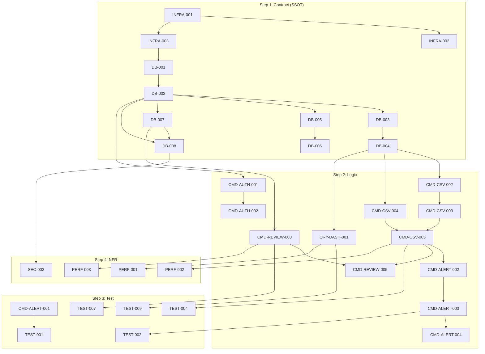

# MVP 개발 태스크 분해 명세서

- **기준 문서:** SRS-001 v1.3 (`SRS_v1.md`)
- **작성일:** 2026-05-02
- **Tech Stack:** Next.js (App Router) · Supabase · Vercel AI SDK · Google Gemini
- **작업 절차:** Contract(Data/API) → Logic(Query/Command) → Test(AC→TDD) → NFR(Infra/Security)

---

## Step 1. 계약 및 데이터 명세 (Contract / Data — SSOT)

> DB 스키마, API DTO, Mock 데이터를 선행 확보하여 프론트/백엔드 에이전트가 참조할 단일 진실 공급원을 구축합니다.

### 1-A. 데이터베이스 (DB Schema & Migration)

| Task ID | Epic | Feature | 관련 SRS 섹션 | Dependencies | 복잡도 |
|---|---|---|---|---|---|
| DB-001 | Infra | Supabase 프로젝트 초기화 및 Next.js 연동 설정 (env, client) | §3.1 External Systems, C-TEC-003 | None | L |
| DB-002 | Data Model | USER 테이블 스키마 및 마이그레이션 스크립트 작성 | §6.2 ERD (USER) | DB-001 | L |
| DB-003 | Data Model | ACCOUNT 테이블 스키마 및 마이그레이션 (id, user_id, status, created_at) | §6.2 ACCOUNT | DB-002 | L |
| DB-004 | Data Model | TRADE 테이블 스키마 및 마이그레이션 (source_file_hash UNIQUE 포함) | §6.2 TRADE | DB-003 | M |
| DB-005 | Data Model | ALERT_RULE 테이블 스키마 및 마이그레이션 (threshold, cooldown_minutes, active) | §6.2 ERD (ALERT_RULE) | DB-002 | L |
| DB-006 | Data Model | ALERT_LOG 테이블 스키마 및 마이그레이션 (rule_id FK, triggered_at) | §6.2 ERD (ALERT_LOG) | DB-005 | L |
| DB-007 | Data Model | TRADE_REVIEW 테이블 스키마 및 마이그레이션 (summary_json JSONB) | §6.2 TRADE_REVIEW | DB-002 | L |
| DB-008 | Security | 전 테이블 Row-Level Security (RLS) 정책 작성 (user_id 기반 격리) | §4.2.4 REQ-NF-020 | DB-002 ~ DB-007 | M |

### 1-B. API 통신 계약 (DTO / Error Code)

| Task ID | Epic | Feature | 관련 SRS 섹션 | Dependencies | 복잡도 |
|---|---|---|---|---|---|
| API-001 | Auth | Auth 도메인 Request/Response DTO 정의 (signup, login) 및 에러 코드 (401, 409) | §6.1 #1~2, §3.3 actions/auth.ts | None | L |
| API-002 | CSV Upload | Trades Upload DTO 정의 (multipart/form-data Request, 성공/에러 Response) | §6.1 #3, §3.3 actions/upload.ts | None | M |
| API-003 | Trades | Trades Query DTO 정의 (GET /trades — 필터, 페이징, Response 구조) | §6.1 #4, §3.3 actions/trades.ts | None | L |
| API-004 | Alerts | Alert Rules CRUD DTO 정의 (GET/POST /alerts/rules — threshold 범위 검증) | §6.1 #5~6, §3.3 actions/alerts.ts | None | L |
| API-005 | AI Review | Reviews DTO 정의 (GET /reviews, POST /reviews/generate — Gemini JSON 스키마) | §6.1 #7~8, §3.3 actions/reviews.ts | None | M |
| API-006 | Dashboard | Dashboard Stats DTO 정의 (GET /dashboard/stats — 승률, MDD, 매매횟수 집계) | §6.1 #9, §3.3 actions/dashboard.ts | None | L |

### 1-C. Mock 데이터

| Task ID | Epic | Feature | 관련 SRS 섹션 | Dependencies | 복잡도 |
|---|---|---|---|---|---|
| MOCK-001 | Auth | 회원가입/로그인 성공·실패 Mock API 엔드포인트 세팅 | §6.1 #1~2 | API-001 | L |
| MOCK-002 | CSV Upload | CSV 업로드 성공·형식 오류·중복 경고 Mock Response 세팅 | §6.1 #3 | API-002 | L |
| MOCK-003 | Trades | 매매 내역 조회 Mock 데이터 (한국투자/토스 표준 CSV 기반 샘플 50건) | §6.1 #4 | API-003 | L |
| MOCK-004 | AI Review | Gemini 복기 일지 Mock JSON (summary_json 샘플 — 인사이트 3종) | §6.1 #7~8 | API-005 | M |
| MOCK-005 | Dashboard | 대시보드 통계 Mock 데이터 (승률, MDD, 매매횟수 샘플) | §6.1 #9 | API-006 | L |

---

## Step 2. 로직 및 상태 변경 분해 (Logic — CQRS)

> 기능 요구사항을 Read(Query)와 Write(Command)로 분리하여 에이전트가 단일 목적에만 집중하도록 격리합니다.

### 2-A. Auth 도메인

| Task ID | Epic | Feature | 관련 SRS 섹션 | Dependencies | 복잡도 |
|---|---|---|---|---|---|
| CMD-AUTH-001 | Auth | Supabase Auth 기반 이메일 회원가입 Server Action 구현 | §3.3 actions/auth.ts | DB-002, API-001 | M |
| CMD-AUTH-002 | Auth | Supabase Auth 기반 로그인 및 세션 관리 Server Action 구현 | §3.3 actions/auth.ts | CMD-AUTH-001 | M |
| UI-AUTH-001 | Auth | 회원가입/로그인 페이지 UI 구현 (shadcn/ui, 반응형) | §3.2, C-TEC-004 | MOCK-001 | M |

### 2-B. F2 — CSV 업로드 및 파싱 도메인

| Task ID | Epic | Feature | 관련 SRS 섹션 | Dependencies | 복잡도 |
|---|---|---|---|---|---|
| CMD-CSV-001 | CSV Upload | 클라이언트 단 파일 크기/확장자 1차 검증 로직 구현 | §3.4.1, REQ-FUNC-008 | API-002 | L |
| CMD-CSV-002 | CSV Upload | Server Action: CSV 헤더·데이터 타입 정합성 2차 검증 로직 구현 | §3.4.1, REQ-FUNC-008 | DB-004, API-002 | M |
| CMD-CSV-003 | CSV Upload | Server Action: CSV 파싱 및 표준 데이터 구조 정규화 (한국투자/토스 템플릿) | §3.4.1, REQ-FUNC-007 | CMD-CSV-002 | H |
| CMD-CSV-004 | CSV Upload | Server Action: source_file_hash 추출 및 DB 중복 확인 로직 구현 | §3.4.1, REQ-FUNC-009 | DB-004 | M |
| CMD-CSV-005 | CSV Upload | Server Action: 정규화된 TRADE 내역 Bulk Insert (DB 적재, ≤5초) | §3.4.1, REQ-NF-004 | CMD-CSV-003, CMD-CSV-004 | M |
| QRY-CSV-001 | Trades | Server Action: 매매 내역 통합 조회 (필터·페이징) | §6.1 #4, REQ-FUNC-018 | DB-004, API-003 | M |
| UI-CSV-001 | CSV Upload | CSV 업로드 화면 UI 구현 (드래그&드롭, 인라인 에러, 업로드 완료 모달) | §3.4.1, REQ-FUNC-007~008 | MOCK-002 | M |

### 2-C. F1 — 뇌동매매 방지 강제 제어 도메인

| Task ID | Epic | Feature | 관련 SRS 섹션 | Dependencies | 복잡도 |
|---|---|---|---|---|---|
| CMD-ALERT-001 | Alerts | Server Action: 알람 규칙 생성 (손실폭 슬라이더 0.5%~30% 범위 검증 포함) | REQ-FUNC-001~002 | DB-005, API-004 | M |
| CMD-ALERT-002 | Alerts | Server Action: CSV 업로드 완료 트리거 → 당일 누적 손실 계산 + 임계치 비교 로직 | §3.4.2, REQ-FUNC-003 | CMD-CSV-005, DB-005 | H |
| CMD-ALERT-003 | Alerts | Server Action: 임계치 도달 시 ALERT_LOG 기록 + 쿨타임(30분) 시작 기록 | §3.4.2, REQ-FUNC-003~004 | CMD-ALERT-002, DB-006 | M |
| CMD-ALERT-004 | Alerts | 이메일 알람 발송 로직 구현 (Supabase Edge Function 또는 Resend 연동) | REQ-FUNC-003, REQ-NF-002 | CMD-ALERT-003 | M |
| CMD-ALERT-005 | Alerts | 매매횟수 상한 설정 및 업로드 시 매매횟수 브레이크 검증 로직 | REQ-FUNC-019 | DB-005, CMD-CSV-005 | M |
| CMD-ALERT-006 | Alerts | 주간 뇌동매매 리포트 자동 생성 및 이메일 발송 로직 | REQ-FUNC-005 | CMD-ALERT-003 | M |
| QRY-ALERT-001 | Alerts | Server Action: 알람 규칙 목록 조회 | §6.1 #5 | DB-005 | L |
| QRY-ALERT-002 | Alerts | Server Action: 쿨타임 잔여 시간 조회 (대시보드 배너 표시용) | REQ-FUNC-004 | DB-006 | L |
| UI-ALERT-001 | Alerts | 알람 설정 화면 UI (손실폭 슬라이더, 매매횟수 상한 입력, 인라인 에러) | REQ-FUNC-001~002, 019 | MOCK-005 | M |
| UI-ALERT-002 | Alerts | 팩트폭행 알람 인앱 모달 + 쿨타임 경고 배너 UI 구현 | REQ-FUNC-003~004, §3.4.2 | QRY-ALERT-002 | M |

### 2-D. F3 — 자동 매매 복기 일지 (Gemini) 도메인

| Task ID | Epic | Feature | 관련 SRS 섹션 | Dependencies | 복잡도 |
|---|---|---|---|---|---|
| CMD-REVIEW-001 | AI Review | Vercel AI SDK 초기화 및 Google Gemini API 연동 설정 | §3.0 AI Layer, §3.1 | DB-001 | M |
| CMD-REVIEW-002 | AI Review | 매매 데이터(JSON) + 분석용 시스템 프롬프트 조립 로직 구현 | §3.4.3, REQ-FUNC-013 | CMD-REVIEW-001, DB-004 | H |
| CMD-REVIEW-003 | AI Review | Gemini 프롬프트 추론 요청 → JSON 응답 파싱 → TRADE_REVIEW 저장 (≤30초) | §3.4.3, REQ-FUNC-013, REQ-NF-006 | CMD-REVIEW-002, DB-007 | H |
| CMD-REVIEW-004 | AI Review | Gemini JSON 파싱 실패 시 재시도 로직 (최대 2회, 실패율 <2%) | REQ-NF-015 | CMD-REVIEW-003 | M |
| CMD-REVIEW-005 | AI Review | CSV 업로드 완료 트리거 → 자동 복기 일지 생성 파이프라인 연결 | §3.4.3, §6.3 Analysis | CMD-CSV-005, CMD-REVIEW-003 | M |
| CMD-REVIEW-006 | AI Review | 주간 복기 요약 PDF 추출 로직 (브라우저 내 다운로드) | REQ-FUNC-015 | CMD-REVIEW-003 | M |
| QRY-REVIEW-001 | AI Review | Server Action: 복기 일지 목록 조회 (날짜별 필터) | §6.1 #7 | DB-007 | L |
| QRY-REVIEW-002 | AI Review | Server Action: 복기 일지 상세 조회 (summary_json 파싱 및 반환) | REQ-FUNC-014 | DB-007 | L |
| UI-REVIEW-001 | AI Review | 복기 일지 목록 화면 UI 구현 (날짜별 카드 리스트) | REQ-FUNC-014 | MOCK-004 | M |
| UI-REVIEW-002 | AI Review | 복기 일지 상세 대시보드 UI (차트 + 요약글, 3분 내 스캔 UX) | REQ-FUNC-014 | MOCK-004 | H |

### 2-E. F5 — 통계 대시보드 도메인

| Task ID | Epic | Feature | 관련 SRS 섹션 | Dependencies | 복잡도 |
|---|---|---|---|---|---|
| QRY-DASH-001 | Dashboard | Server Action: 전체/기간별 승률·MDD·매매횟수 통계 집계 쿼리 구현 | REQ-FUNC-018, §6.1 #9 | DB-004, API-006 | H |
| QRY-DASH-002 | Dashboard | Server Action: 주간/월간 리포트 데이터 집계 (뇌동매매 횟수, 손실액) | REQ-FUNC-005 | DB-004, DB-006 | M |
| UI-DASH-001 | Dashboard | 통합 대시보드 메인 화면 UI (승률 차트, MDD 그래프, 매매횟수 바) | REQ-FUNC-018 | MOCK-005 | H |
| UI-DASH-002 | Dashboard | 주간/월간 리포트 조회 화면 UI | REQ-FUNC-005 | QRY-DASH-002 | M |

---

## Step 3. 인수 조건(AC)을 테스트 태스크로 변환

> SRS에 명시된 GWT(Given-When-Then) 인수 조건을 자동화된 테스트 코드 작성 태스크로 변환합니다.

| Task ID | Epic | Feature | 관련 SRS AC | Dependencies | 복잡도 |
|---|---|---|---|---|---|
| TEST-001 | Alerts | 알람 규칙 생성 성공/범위 외 입력 거부(0.5%미만, 30%초과) 단위 테스트 | REQ-FUNC-001~002 AC | CMD-ALERT-001 | M |
| TEST-002 | Alerts | CSV 업로드 후 누적손실 ≥ 임계치 시 즉각 알람 발동 통합 테스트 | REQ-FUNC-003 AC | CMD-ALERT-002, CMD-ALERT-003 | H |
| TEST-003 | Alerts | 알람 발동 후 30분 쿨타임 경고 고정 표시 검증 테스트 | REQ-FUNC-004 AC | CMD-ALERT-003, QRY-ALERT-002 | M |
| TEST-004 | CSV Upload | 유효 CSV 파싱 → DB 적재 성공 (한국투자/토스 템플릿) E2E 테스트 | REQ-FUNC-007 AC | CMD-CSV-003, CMD-CSV-005 | M |
| TEST-005 | CSV Upload | CSV 헤더 형식 불일치 시 인라인 에러 반환 단위 테스트 | REQ-FUNC-008 AC | CMD-CSV-002 | L |
| TEST-006 | CSV Upload | 동일 파일 재업로드 시 해시 매칭으로 중복 차단 단위 테스트 | REQ-FUNC-009 AC | CMD-CSV-004 | L |
| TEST-007 | AI Review | 매매 건수 ≥ 1일 때 Gemini 프롬프트 → 구조화된 일지 저장 통합 테스트 | REQ-FUNC-013 AC | CMD-REVIEW-003 | H |
| TEST-008 | AI Review | 매매 건수 = 0일 때 빈 일지 미생성 (안내 카드 표시) 단위 테스트 | §3.4.3 alt 분기 | CMD-REVIEW-005 | L |
| TEST-009 | Dashboard | 대시보드 진입 시 차트 정상 렌더링 E2E 테스트 | REQ-FUNC-018 AC | QRY-DASH-001, UI-DASH-001 | M |
| TEST-010 | Alerts | 매매횟수 상한 도달 시 강제 휴식 권고 알림 단위 테스트 | REQ-FUNC-019 AC | CMD-ALERT-005 | M |
| TEST-011 | AI Review | Gemini JSON 파싱 실패 시 재시도 (최대 2회) 및 실패율 <2% 검증 테스트 | REQ-NF-015 AC | CMD-REVIEW-004 | M |

---

## Step 4. 비기능 제약(NFR) 및 인프라 태스크 + 의존성 매핑

### 4-A. 인프라 / 보안 / 성능

| Task ID | Epic | Feature | 관련 SRS 섹션 | Dependencies | 복잡도 |
|---|---|---|---|---|---|
| INFRA-001 | Infra | Next.js 15+ (App Router) 프로젝트 초기화 + Tailwind CSS + shadcn/ui 적용 | C-TEC-001, C-TEC-004 | None | M |
| INFRA-002 | Infra | Vercel Pro 배포 설정 (Git Push 자동 배포, 환경변수 구성) | C-TEC-007, REQ-NF-024 | INFRA-001 | L |
| INFRA-003 | Infra | Supabase Pro 환경 구성 (PostgreSQL, Storage, Realtime, Auth) | C-TEC-003, §3.1 | INFRA-001 | M |
| SEC-001 | Security | TLS 1.3 전 트래픽 암호화 확인 (Vercel 기본 HTTPS 검증) | REQ-NF-018 | INFRA-002 | L |
| SEC-002 | Security | Supabase RLS 정책 전 테이블 적용 및 교차 사용자 접근 차단 검증 테스트 | REQ-NF-020 | DB-008 | M |
| SEC-003 | Security | 개인정보보호법(PIPA) 대응: 동의 이력 관리 로직 및 데이터 파기 정책 구현 | REQ-NF-023a | DB-002 | M |
| PERF-001 | Performance | 대시보드 API p95 ≤ 500ms 검증 (10명 동시접속 기준 부하 테스트) | REQ-NF-001, REQ-NF-009 | QRY-DASH-001 | M |
| PERF-002 | Performance | CSV 파싱·적재 ≤ 5초 검증 (1,000건 기준 성능 테스트) | REQ-NF-004 | CMD-CSV-005 | M |
| PERF-003 | Performance | Gemini 복기 일지 생성 ≤ 30초 검증 | REQ-NF-006 | CMD-REVIEW-003 | L |
| PERF-004 | Performance | 알람 감지→이메일 큐 적재 ≤ 1초 검증 | REQ-NF-002 | CMD-ALERT-004 | L |
| COST-001 | Cost | 월 인프라 비용 $45 이내 확인 (Vercel Pro $20 + Supabase Pro $25) | REQ-NF-024 | INFRA-002, INFRA-003 | L |

### 4-B. 의존성 그래프 (핵심 선후 관계)

---

## 전체 태스크 요약 (Sprint 배치 가이드)

| Sprint | 주요 범위 | 태스크 수 | 핵심 산출물 |
|---|---|---|---|
| **Sprint 0 (Week 1)** | Infra + DB Schema + API DTO + Mock | 25건 | SSOT 확보 (프론트/백엔드 병렬 작업 가능) |
| **Sprint 1 (Week 2)** | Auth + CSV Upload (Command/Query) + UI | 13건 | 데이터 섭취 파이프라인 완성 |
| **Sprint 2 (Week 3)** | Alerts (F1) + Dashboard (F5) + UI | 14건 | 뇌동매매 방지 핵심 루프 완성 |
| **Sprint 3 (Week 4)** | AI Review (F3) + Test + NFR 검증 | 18건 | Gemini 복기 + E2E 테스트 + 성능 검증 |

> **총 태스크: 70건** (DB 8 + API 6 + Mock 5 + Command 21 + Query 7 + UI 9 + Test 11 + Infra/NFR 3+8 = 70)
